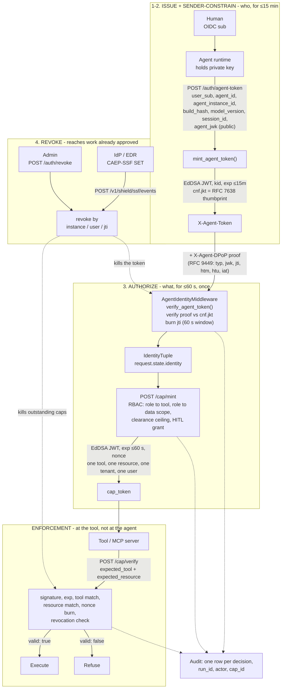

# Agentic Identity Architecture

How Shield authenticates and authorizes agent actions at runtime: the threat
model, the layered design, the on-the-wire token formats, and where each piece
lives in the code.

For the conceptual introduction, read
[Non-Human Identity](/non-human-identity/) first. This page is the
implementation.

## 0. The four functions

An agent identity provider does four things. Shield implements all four, and
the endpoint for each is named here so the rest of this page has somewhere to
point.

| Function | What it answers | Where |
|---|---|---|
| **Issue** | Who is this agent, acting for which human, running which build? | `POST /v1/shield/auth/agent-token` |
| **Sender-constrain** | Is the holder of this token the party it was issued to? | `cnf.jkt` + a proof in `X-Agent-DPoP` |
| **Authorize** | May this action happen, on this resource, right now? | `POST /v1/shield/cap/mint` → `/cap/verify` |
| **Revoke** | Stop it - including work already approved | `POST /v1/shield/auth/revoke`, CAEP/SSF |

The separation matters. Issue and sender-constrain are **slow** properties of a
process (≤15 minutes). Authorize is a **fast** property of a single action
(≤60 seconds, one-shot). Collapsing them is the mistake classical IAM makes:
a credential that proves who you are and also permits everything you may do
gives an attacker who steals it both answers at once.



The dotted lines from **REVOKE** are the property worth noticing: revocation
reaches both the token check *and* the capability check. A revoked agent's
already-minted capabilities stop verifying. A control that only stopped the
next mint would leave every approved-but-unexecuted action live.

## 1. The Problem

Classical IAM (API keys, OAuth, IAM roles) makes assumptions that break
for agentic systems:

* **One bearer = one principal.** Reality: a tool call has a human user,
  an agent identity, and often an upstream agent that delegated.
* **Authorization is identity-only.** Reality: whether `send_email` is
  allowed depends on what's *in* the email (PII, taint origin, prior
  tool outputs), not just who is calling.
* **Decisions per session.** Reality: a single agent session can fan out
  to hundreds of tool calls across sub-agents; audit needs to be
  per-action, not per-session.

This implementation closes those gaps with two distinct token types:
an **agent token** (AuthN) and a **capability token** (AuthZ).

## 2. Block Diagram

```
┌──────────────────────────────────────────────────────────────────────────────┐
│  Legend:                                                                     │
│   ░░░░  AuthN zone  - proves WHO (identity, slow-changing, ≤15m)             │
│   ▓▓▓▓  AuthZ zone  - decides WHAT (permission, per-action, ≤60s)            │
│   ████  Enforcement zone - verifies the AuthZ decision at the tool           │
└──────────────────────────────────────────────────────────────────────────────┘

  Human User (OIDC + MFA) ────►  Agent Runtime
                                  ░ workload SVID + user id_token
                                  ░ ↓
                                  ░ POST /v1/shield/auth/agent-token
                                  ░ ↓
                                  ░ X-Agent-Token = signed agent_token
                                  ▼
                       ┌─────────────────────────────────────────┐
                       │  LLM-SHIELD GATEWAY                     │
                       │                                         │
   ░ AuthN ──► AgentIdentityMiddleware                          │
   ░          verify_agent_token() → IdentityTuple              │
   ░          (request.state.identity)                          │
                       │                                         │
   ▓ AuthZ ──► POST /v1/shield/cap/mint                         │
   ▓          _decide_authz(identity, request):                 │
   ▓            - rbac: role → tool, role → data                │
   ▓            - clearance ceiling                             │
   ▓            - (taint, delegation, sensitive-action hooks)   │
   ▓          mint_cap(identity, tool, resource, scope, exp≤60s)│
   ▓          → returns signed cap_token                        │
                       └─────────────────────────────────────────┘
                                  │
                       ┌──────────┼──────────┐
                       ▼          ▼          ▼
                  █ Tool A    █ Tool B    █ Tool C
                  POST /v1/shield/cap/verify
                  - signature, exp, tool match, nonce one-shot
                  - cap_id revocation check
                  - returns valid=true|false + claims

                       Audit log: one signed row per decision.
                       Control plane: revoke(instance|user|jti).
```

## 2a. Customer integration path (no admin key needed)

Customers integrate with the platform using their **tenant API key**, the
same key they use for every other tenant endpoint. They never see the
admin key.

The customer-facing endpoints:

| Method | Path                                            | Auth         | Purpose                          |
|--------|-------------------------------------------------|--------------|----------------------------------|
| POST   | `/v1/tenant/me/agent-auth/agent-token`          | `X-API-Key`  | Exchange tenant key for an agent token. `tenant_id` is auto-filled from the key - clients cannot mint tokens for other tenants. |
| POST   | `/v1/shield/cap/mint`                           | `X-Agent-Token` | Mint a capability for one tool call. |
| POST   | `/v1/shield/cap/verify`                         | (none - cap is bearer)   | Tool-server side verification + nonce burn. |
| GET    | `/v1/tenant/me/agent-auth/stats`                | `X-API-Key`  | Per-event counters for the portal. |
| GET    | `/v1/tenant/me/agent-auth/recent`               | `X-API-Key`  | Last 50 events for the portal. |

The admin endpoints (`POST /v1/shield/auth/agent-token`,
`POST /v1/shield/auth/revoke`) stay for control-plane / break-glass use.

A ready-to-paste customer SDK is at `examples/shield_client.py`. Wrapped
integrations for LangChain and raw OpenAI/Anthropic tool-use are in
`examples/langchain_shielded_tool.py` and `examples/openai_shielded_tool.py`.

## 3. AuthN - Agent Tokens

### What an agent token proves

```
{
  user_sub:           "user-42"          ← OIDC sub of the human
  agent_id:           "billing-bot"      ← logical agent identity
  agent_instance_id:  "inst-abc-1"       ← this running process
  parent_agent_id:    null | "parent"    ← who delegated, if any
  tenant_id:          "tenant-1"
  build_hash:         "sha256:..."       ← exact code build
  model_version:      "claude-opus-4.7"
  session_id:         "sess-123"
  iat, exp:           Unix seconds       ← exp ≤ iat + 15m
  jti:                "..."              ← revocable per-token id
  kid:                "env"              ← signing key id (rotation)
}
```

### Wire format

Standard JWT (RFC 7519) with EdDSA (Ed25519) signatures:

```
<base64url(header)>.<base64url(claims_json)>.<base64url(ed25519_signature)>
```

Header: `{"alg": "EdDSA", "typ": "JWT", "kid": "<key-id>"}`

Verifiable by any standards-compliant JWT library (PyJWT, jose4j, go-jose,
jsonwebtoken). Public keys available at `GET /oauth/jwks` in OKP JWK format.

Legacy two-segment format (`base64url(claims).base64url(sig)`) is still
accepted during verification for backward compatibility.

Carried in the `X-Agent-Token` header.

### Verification (`core/agent_tokens.py::verify_agent_token`)

1. Decode and Ed25519-verify the signature with the `kid`'s public key.
2. Check `exp` (allows 5s clock skew) and `iat`.
3. Enforce required claims.
4. If `SHIELD_AGENT_ALLOWED_BUILDS` is set, enforce build allowlist.
5. Check the three revocation lists: instance, jti, user.

On success returns an `IdentityTuple` (see `core/identity.py`). On any
failure raises `TokenError`. The `AgentIdentityMiddleware` catches that
and returns 401.

### Key material

LLM-Shield runs **on-prem**. No external/cloud key service is required
or assumed. The signer interface (`core/signers.py::Signer`) supports
three backends, selected per token type at startup. See §10 for details.

| Env var                            | Effect                                    |
|------------------------------------|-------------------------------------------|
| `SHIELD_AGENT_TOKEN_PRIVATE_KEY`   | Hex-encoded 32-byte Ed25519 private key   |
| `SHIELD_AGENT_TOKEN_KID`           | Key id stamped in the `kid` claim         |
| `SHIELD_SIGNER_BACKEND_AGENT`      | `local` \| `pkcs11` \| `vault` (default: `local`) |

If no private key is provided in `local` mode, the process generates an
ephemeral keypair and emits a warning - dev/test only.

### Signing-key rotation

The token header carries `kid`, so more than one signing key can verify at a
time. `_retired_kids()` reads a comma-separated list of key ids that **must
never verify again**, checked before signature verification. Rotation is
therefore: add the new key, move `SHIELD_AGENT_TOKEN_KID` to it, wait out the
15-minute token lifetime, then retire the old kid.

Retirement is separate from removal on purpose. Deleting a key makes old tokens
fail as *malformed*; retiring it makes them fail as *rejected*, which is the
difference between a confusing incident and a legible one.

## 3a. Sender-constraint - proof-of-possession

Everything above still describes a **bearer** token: whoever holds the bytes is
the agent, for up to 15 minutes, and can mint capabilities for anything that
agent's role permits. A copy in a log file, an APM trace or a proxy access log
is a working credential.

Binding closes that. It is a two-party property: the issuer puts a key
thumbprint in the token, and the holder proves possession of the matching
private key on every request.

**At mint.** The agent generates a keypair - the private key never leaves the
process - and sends the **public** JWK as `agent_jwk`. Shield takes its
RFC 7638 thumbprint and embeds it as `cnf: {"jkt": "..."}`.

**Per request.** The agent signs a small JWT and sends it in **`X-Agent-DPoP`**:

```
header  { "typ": "dpop+jwt", "alg": "ES256", "jwk": <public JWK> }
claims  { "jti": "<unique>", "htm": "POST",
          "htu": "https://shield.example.com/v1/shield/cap/mint",
          "iat": 1770000000 }
```

All four claims are required (`core/dpop.py`, RFC 9449). `htm` must match the
method; `htu` is compared canonically - scheme + host + path, query and fragment
stripped. A proof whose header JWK contains private-key members is rejected
outright.

The header is deliberately **not** `DPoP`: `identity_resolution.verify_token_binding`
already consumes that one for workload-identity binding, and with both bindings
active on different keypairs a single header cannot satisfy two thumbprints.

**Verification order.** `typ` → proof signature against its own JWK →
thumbprint equals `cnf.jkt` *(this is the binding)* → `htm`/`htu` match →
`iat` within skew → `jti` claimed atomically in a **60-second replay window**.

**Rollout.** `SHIELD_AGENT_TOKEN_POP`:

| Mode | Behaviour |
|---|---|
| `off` *(default)* | No header read, no crypto. Zero cost. |
| `optional` | Verifies a proof when the token is bound, records `verified` / `failed`, **denies nothing**. The observation rung: ship keys, watch the rate reach 100%. |
| `required` | A bound token without a valid proof is refused. |

`SHIELD_AGENT_TOKEN_POP_ALLOW_UNBOUND` is the migration rung: under `required`,
still accept tokens carrying no `cnf` at all, so clients that have not shipped a
key keep working while those that have are strictly enforced. Going from "deny
nothing" straight to "deny every legacy token" is where the outage lives.

**Residual risk.** Binding does not help if the attacker compromises the agent
*process* - they hold the key too. It kills the far more common case: the
credential escaping without it.

## 4. AuthZ - Capability Tokens

### What a cap token grants

```
{
  user_sub, agent_id, agent_instance_id    ← bound to AuthN identity
  tenant_id
  tool:           "send_email"             ← exact, not a wildcard
  resource:       "user/42/inbox"          ← exact target
  scope:          ["to:user@example.com"]  ← constraints intersection
  clearance_max:  "internal"               ← data ceiling
  parent_cap_id:  null | "..."             ← for delegated calls
  nonce:          "..."                    ← one-shot
  iat, exp:       Unix seconds             ← exp ≤ iat + 60s
  cap_id:         "..."                    ← revocable per-cap id
  kid:            "cap-env"
}
```

### Why a separate signer from agent tokens

Tool servers only need the cap public key - they never need the agent-
token public key. A compromised tool can therefore only see (already
narrowly-scoped) caps; it cannot forge identity tokens.

### Mint (`POST /v1/shield/cap/mint`)

Requires a verified `X-Agent-Token`. The handler:

1. Pulls `IdentityTuple` from `request.state.identity`.
2. Runs `_decide_authz(identity, body)`:
   * RBAC role → tool check
   * RBAC role → data scope check
   * Clearance ceiling: `body.clearance_max` ≤ role's `data_clearance`
3. If denied → 403 with reasons (no cap minted).
4. If allowed → `mint_cap(...)` → returns `cap_token` (≤60s TTL).

The decision is also returned in the response for audit.

### Verify (`POST /v1/shield/cap/verify`)

Called by the tool / MCP server before executing. Checks:

1. Ed25519 signature with `kid`'s public key.
2. `exp` (allows 2s clock skew).
3. `tool` matches `expected_tool`.
4. (Optional) `resource` matches `expected_resource`.
5. `cap_id` not in revocation list.
6. Atomically burn `nonce` (Redis SETNX, or fallback dict).
   On second use → "replay detected".

Returns `{valid, claims}` or `{valid: false, error}`.

## 4a. Defense-in-depth (H1, H3, M1, M2, M3, M5)

These are the runtime hardenings on top of the core scheme. Each maps
to a specific failure mode a real adversary would exploit.

| Defense                         | Env var                              | What it stops |
|---------------------------------|--------------------------------------|----------------|
| `iss` + `aud` claim binding     | `SHIELD_ISSUER`, `SHIELD_AGENT_AUDIENCE`, `SHIELD_CAP_AUDIENCE` | Tokens from one Shield deployment validating in another; a leaked agent-token verifying as a cap |
| Token-issuance rate limit       | `SHIELD_RATELIMIT_TOKEN_PER_MIN` (60), `SHIELD_RATELIMIT_TOKEN_PER_DAY` (100k) | Stolen tenant API key minting unbounded tokens |
| Cap-mint rate limit             | `SHIELD_RATELIMIT_CAP_PER_MIN` (600), `SHIELD_RATELIMIT_CAP_PER_DAY` (1M)    | One noisy/malicious agent_instance_id burning all caps |
| Multi-worker hard-fail          | `SHIELD_ALLOW_INMEMORY_MULTIWORKER` (override) | Per-worker nonce/rate-limit state allowing replays across processes |
| Retired-kid blocklist           | `SHIELD_RETIRED_KIDS=kid-old1,kid-old2` | Rotated keys still validating tokens after key rotation |
| Quiet denial mode               | `SHIELD_VERBOSE_REASONS` (default off) | Attackers enumerating RBAC roles/tools via the denial API. Full reasons still in the audit log. |

**Defaults are secure.** Production deployments only need to set `SHIELD_ISSUER`
to a per-environment value (`shield-prod`, `shield-staging`) and provide Redis.

## 5. Revocation

Three independent axes (`storage/revocation.py`):

| Function           | What it kills                            |
|--------------------|------------------------------------------|
| `revoke_instance`  | One running agent process               |
| `revoke_user`      | Everything a compromised user did       |
| `revoke_jti`       | One specific token or cap (by jti/cap_id)|

Backed by Redis when present; in-process fallback otherwise. TTL =
3600s by default (longer than max token lifetime), so revoke entries
auto-clean.

Exposed via `POST /v1/shield/auth/revoke` (admin-key gated).

Revocation checks run inside `verify_agent_token` and `verify_cap`, so
revocation propagates within one verify call - no caches to bust.

That second call site is the point. Because `verify_cap` checks revocation too,
a revoked agent's **already-minted capabilities stop verifying**. Revocation
that only blocked the next mint would leave every approved-but-unexecuted action
live - which, in an agent that mints ahead of a fan-out, is most of them.

### Continuous revocation - CAEP / SSF

Shield speaks the OpenID Shared Signals Framework in **both** directions
(`core/caep.py`, `api/routes_ssf.py`), so revocation is not limited to what
Shield itself notices.

| | |
|---|---|
| **Consume** | `POST /v1/shield/ssf/events` accepts pushed SETs. A `session-revoked`, `credential-change` or non-compliant `device-compliance-change` for a subject revokes the matching agent instance or user. |
| **Emit** | When Shield revokes an agent, it builds a standard CAEP `session-revoked` SET (RFC 8417, signed) and pushes it to a configured receiver, so the rest of the ecosystem drops the agent too. |
| **Discover** | `GET /v1/shield/ssf/.well-known/ssf-configuration` |

Both endpoints are on the **data plane** - revocation has to reach the guard
path, not the portal.

This is what lets an IdP or EDR drive Shield: your directory detects a
termination, your EDR flags a compromised host, the signal arrives, and the
agent's token *and its outstanding capabilities* die mid-flight. A directory can
stop the next sign-in; only the enforcement point can stop the action already
underway.

| Env var | Purpose |
|---|---|
| `SHIELD_ENABLE_AUTO_REVOKE` | Master switch - **off by default** |
| `SHIELD_AUTO_REVOKE_GUARDRAILS` | Which guardrail hits trigger a revoke |
| `SHIELD_SSF_PUSH_URL` / `_TOKEN` | Receiver for emitted SETs |
| `SHIELD_SSF_PRIVATE_KEY` | Ed25519 key for signing SETs |

## 6. End-to-end Sequence

```
1. User logs in (OIDC)                               → id_token
2. Agent starts (workload SVID)                      → workload identity
3. POST /v1/shield/auth/agent-token                  → agent_token (≤15m)
   (token exchange - gated by SHIELD_ADMIN_KEY in v1)
4. Agent calls /v1/shield/cap/mint with X-Agent-Token
   - middleware verifies → IdentityTuple
   - policy decides AuthZ
   - mint cap                                        → cap_token (≤60s)
5. Agent passes cap_token to the tool server
6. Tool calls /v1/shield/cap/verify
   - sig + exp + tool match + nonce burn             → valid|invalid
7. Tool executes the action (only if valid).
8. If something looks wrong:
   POST /v1/shield/auth/revoke {agent_instance_id|user_sub|jti}
   - propagates instantly on the next verify call.
```

## 7. Threat → Control Matrix

| Threat                                       | Control                                                 |
|----------------------------------------------|---------------------------------------------------------|
| Stolen long-lived API key                    | No long-lived agent secret; tokens ≤15m, Ed25519-signed |
| Replayed capability token                    | One-shot nonce burn at verify                           |
| Prompt-injected tool abuse                   | Cap minted *before* LLM sees user instruction; tool field is exact, not wildcard |
| Confused-deputy / over-broad sub-agent       | Cap carries scope intersection; downstream cannot widen |
| Tool server trusts agent's word              | Tool verifies cap signature locally against distributed pubkey |
| Tampered agent build / wrong model           | `build_hash` claim checked against allowlist            |
| Compromised agent in flight                  | `revoke_instance(agent_instance_id)` - effect ≤1s       |
| Cross-tenant leakage                         | `tenant_id` in every cap, checked constant-time at tool |
| "How did this happen?" 3 weeks later         | One signed audit row per decision, replayable           |

## 8. Production Hardening

This is an **on-prem** product. No cloud-managed services are required.

### What is on out of the box, and what you must turn on

Every control below is secure-by-default in the sense that it does not *break*
anything on install - which also means most of them are not protecting anything
until you enable them. Read this table as a checklist, not a feature list.

| Control | Default | Enable with | Rung before enforce |
|---|---|---|---|
| Agent token issuance + verification | **on** | - | - |
| Capability mint / verify | **on**, but the guard path is advisory unless tools verify | route tools through `/cap/verify` or the MCP gateway | - |
| Sender-constraint (PoP) | **off** | `SHIELD_AGENT_TOKEN_POP` | `optional` |
| Role binding to a real user token | **off** | `SHIELD_ROLE_BINDING` | `prefer` |
| Auto-revoke / CAEP-driven | **off** | `SHIELD_ENABLE_AUTO_REVOKE` | - |
| Registry write authorization | **off** | `SHIELD_REGISTRY_WRITE_SCOPE` | `warn` |

Each of these has a declare-then-enforce rung for a reason: it records who
*would* be refused before anything is. Skipping it is how a rollout becomes an
outage.

`GET /v1/tenant/me/posture` reports the live value of all of these, and the
portal Overview surfaces the count - so "what is this deployment actually
enforcing" is a question with an answer rather than an audit.

### Implemented

* **Standard JWT format (RFC 7519)** with `alg: EdDSA`. Tokens are
  verifiable by any JWT library. JWKS endpoint at `GET /oauth/jwks`.
* **OAuth 2.1 authorization server** with PKCE, dynamic client
  registration (RFC 7591), and token exchange (RFC 8693). MCP clients
  connect via standard OAuth flows.
* **External OIDC integration** - validate id_tokens from Keycloak,
  Okta, Auth0, Azure AD. Per-tenant provider configuration.
* **SPIFFE workload identity** - accept JWT and X.509 SVIDs as
  alternative to admin-key for automated workloads. On-prem friendly
  with local trust bundles and JWKS files.
* **mTLS middleware** - extract client cert identity from
  `X-Forwarded-Client-Cert` (Envoy/Istio) or direct TLS.
* **A2A protocol** - Google Agent-to-Agent support with Agent Card
  discovery, task lifecycle, and SSE streaming. All messages route
  through the guardrail pipeline.

### Planned

* **Move signing into an HSM or Vault** for environments that need it.
  The `Signer` interface is already in place; see §10.
* **Stream audit rows to immutable on-prem storage** (Kafka → ClickHouse,
  or write-once object storage like MinIO with object lock). Inline DB
  writes do not scale to high tool-call rates.
* **Bloom-filter front the revocation store** to skip ~99% of Redis
  GETs. Revocation is rare, so a per-pod 1MB bloom absorbs the hot path
  and only falls through to Redis for true positives + false positives.
* **Shard Redis by tenant** so one noisy tenant cannot saturate the
  revocation store for others.
* **Ship a tool-server SDK** (Python + TS) that bundles cap verification
  with the public key, so tools do not need an HTTP call to Shield.
  Public keys are distributed out-of-band (config, secret store).

## 9. Scale Notes

The protocol is stateless on the verify side, so adding Shield pods
scales linearly. The bottlenecks are storage-layer:

| Component                | Bottleneck                | On-prem mitigation               |
|--------------------------|---------------------------|----------------------------------|
| Agent-token verify       | 3 Redis GETs (revocation) | Per-pod bloom filter             |
| Cap verify               | 1 Redis SETNX (nonce)     | Redis Cluster sharded by nonce   |
| Cap signing throughput   | Sequential HSM calls      | LocalEd25519Signer (≈30µs/sig) or envelope signing through Vault |
| Audit fan-out            | Synchronous writes        | Async producer → Kafka           |

The token formats and verify logic do not change with these - they are
storage-layer swaps behind existing interfaces.

## 10. Signing Backends

`core/signers.py` defines a `Signer` protocol with three backends. Both
agent-token signing and cap-token signing dispatch through it
independently, so a deployment can use (for example) HSM for agent
tokens and the local signer for caps.

### Selection

```
SHIELD_SIGNER_BACKEND          # default for both (default: local)
SHIELD_SIGNER_BACKEND_AGENT    # override for agent tokens
SHIELD_SIGNER_BACKEND_CAP      # override for caps
```

Values: `local` (default), `pkcs11`, `vault`.

### `LocalEd25519Signer` (default)

Process-resident Ed25519 keypair. Suitable for:
* hardened hosts (key mlock'd, host-disk-encrypted, TPM-sealed at boot),
* dev / staging,
* deployments where throughput dominates HSM compliance requirements.

Throughput: ~30µs/sign, ~50µs/verify, no I/O. One 8-core pod sustains
~150k verifies/sec.

### `PKCS11Signer` (stub - production-ready shape)

Delegates signing to an HSM via PKCS#11. Verify stays in-process using a
public key loaded from disk at startup - no HSM round trip on the hot
path.

Config:
```
SHIELD_PKCS11_LIBRARY        path to e.g. libsofthsm2.so
SHIELD_PKCS11_TOKEN_LABEL    HSM token label
SHIELD_PKCS11_KEY_LABEL      private-key label inside the token
SHIELD_PKCS11_USER_PIN_FILE  file containing the user PIN (mode 0400)
SHIELD_PKCS11_PUBLIC_KEY     path to raw 32-byte Ed25519 pubkey
```

To activate: `pip install python-pkcs11`, then fill in the `sign()`
method per the docstring. The stub raises a clear `NotImplementedError`
if instantiated unconfigured.

Throughput: typically 1k–10k sigs/sec depending on HSM hardware. Below
the local backend, but offers tamper-resistant key storage and FIPS
140-2 Level 3 attestations where compliance requires.

### `VaultTransitSigner` (stub - production-ready shape)

Delegates signing to HashiCorp Vault's Transit secret engine. Verify
again stays local.

Config:
```
SHIELD_VAULT_ADDR            e.g. https://vault.internal:8200
SHIELD_VAULT_TOKEN_FILE      AppRole / token file path (mode 0400)
SHIELD_VAULT_TRANSIT_KEY     transit key name (must be Ed25519)
SHIELD_VAULT_PUBLIC_KEY      path to raw 32-byte Ed25519 pubkey
SHIELD_VAULT_NAMESPACE       (optional, Enterprise)
```

To activate: `pip install hvac`, then fill in `sign()` per the
docstring. Throughput: ~3k sigs/sec per Transit instance; for higher
throughput, run Transit in HA + batch mode, or implement envelope
signing (cache a Vault-issued short-lived data key in pod memory,
rotate every N minutes).

### Why public-key verify is always local

The hot path is verify, not sign. Routing verify through an HSM or
Vault would impose a network round trip on every tool call - that is
the wrong tradeoff. All three backends load the public key from disk
at startup and verify with `cryptography`, keeping verify CPU-bound and
under 100µs.

## 11. Where the code lives

### Core AuthN/AuthZ

| File                                           | Role                                |
|------------------------------------------------|-------------------------------------|
| `core/identity.py`                             | `IdentityTuple` + request dependency|
| `core/signers.py`                              | Signer protocol + 3 backends        |
| `core/jwt_utils.py`                            | JWT encode/decode/JWKS (RFC 7519)   |
| `core/agent_tokens.py`                         | Mint/verify agent tokens (JWT)      |
| `core/capabilities.py`                         | Mint/verify capability tokens (JWT) |
| `core/agent_identity_middleware.py`            | Verifies `X-Agent-Token` + mTLS fallback |
| `storage/revocation.py`                        | Three revocation axes               |
| `api/routes_agent_auth.py`                     | All HTTP endpoints + AuthZ decision |

### OAuth 2.1 / OIDC / Federation

| File                                           | Role                                |
|------------------------------------------------|-------------------------------------|
| `core/oauth/authz_server.py`                  | OAuth 2.1 authorization server core |
| `core/oauth/pkce.py`                           | PKCE (RFC 7636) utilities           |
| `core/oauth/oidc_client.py`                   | External OIDC relying party         |
| `core/oauth/jwks_cache.py`                    | JWKS key cache (Redis + in-memory)  |
| `core/oauth/spiffe.py`                        | SPIFFE SVID validation              |
| `core/oauth/spiffe_middleware.py`             | SPIFFE request middleware            |
| `core/mtls_middleware.py`                      | mTLS client cert extraction         |
| `storage/oauth_store.py`                       | OAuth clients, codes, refresh tokens|
| `api/routes_oauth.py`                          | OAuth endpoints (metadata, token, JWKS) |
| `api/routes_oauth_registration.py`            | Dynamic client registration (RFC 7591) |
| `api/routes_oidc_admin.py`                    | OIDC provider management            |

### A2A Protocol

| File                                           | Role                                |
|------------------------------------------------|-------------------------------------|
| `core/a2a/agent_card.py`                      | A2A Agent Card schema               |
| `core/a2a/task.py`                             | A2A Task lifecycle                  |
| `api/routes_a2a.py`                            | A2A endpoints + guardrail routing   |

### Tests

| File                                           | Role                                |
|------------------------------------------------|-------------------------------------|
| `tests/test_agent_tokens.py`                   | AuthN unit tests                    |
| `tests/test_capabilities.py`                   | AuthZ unit tests                    |
| `tests/test_revocation.py`                     | Revocation tests                    |
| `tests/test_signers.py`                        | Signer dispatcher + backend tests   |
| `tests/test_agent_auth_e2e.py`                 | End-to-end FastAPI tests            |

### Customer Resources

| File                                           | Role                                |
|------------------------------------------------|-------------------------------------|
| `docs/customer-auth-flow.md`                   | Step-by-step integration guide      |
| `demos/customer_auth_flow.sh`                  | Runnable demo script (success+failure)|
