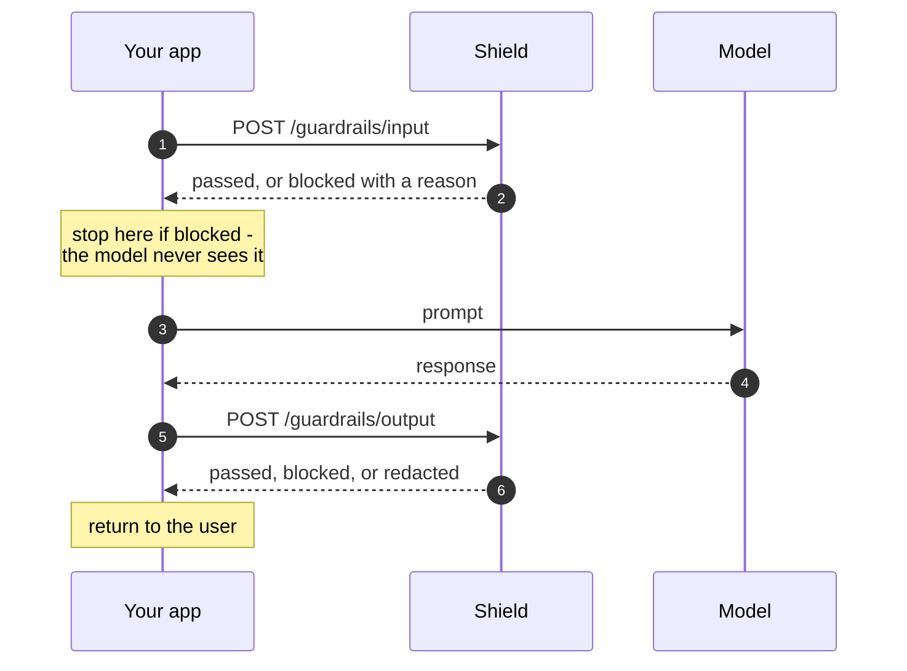
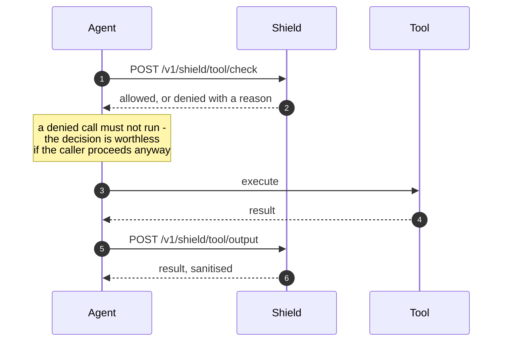

# API Explorer

The partner-facing subset of the Shield API, rendered from
[`openapi-partner.json`](/assets/openapi-partner.json). Import that file
directly into Postman, Insomnia, or a client generator.

For prose and integration patterns see the
[API Reference](/api-reference/); this page is the contract.

## The two flows

Everything else on this page configures or observes these two sequences.

**Content path** - wrap your model call. Screen what goes in, screen what comes
back out.



**Tool path** - wrap each tool call. Ask before it runs, screen what it
returns. An MCP gateway sits exactly here.



The two are independent. Guarding the content path stops prompt injection and
data leaving in text; guarding the tool path stops the action. Most
integrations want both, and starting with one is fine.

## Which integration is this?

Shield supports two shapes, and this page documents the first. Committing to
one matters, because the setup and the calls differ.

**Embed (this page).** Your gateway calls Shield over HTTP around each
`tools/call`. You keep the enforcement point, the traffic path and the data
inside your own infrastructure. This is the shape to build against.

**Hosted gateway.** Your clients point at a Shield gateway route and we sit in
the traffic path. Different setup entirely - upstream registration, identity
headers - and not described here.

If you find a third surface in older guides (`/v1/shield/mcp/check`), it
predates this spec. Build against what is on this page.

## Your first integration

1. **Create a runtime key** - `POST /v1/tenant/me/api-keys`. Runtime scope is
   enough for the guard calls and cannot change configuration, so it is the key
   to put on the hot path.
2. **Register the agent** - `POST /v1/agents/registry`, then set the
   role-to-tool policy with `PUT /v1/agents/tools/policies`. Do this **before**
   the first `tool/check`: an unregistered agent is denied by RBAC, which looks
   like a broken API and is actually unfinished setup.
3. **Call `/guardrails/input`** with a prompt you expect to fail. Confirm you
   get a block before you trust a pass.
4. **Wrap the model** - add `/guardrails/output` on the way back.
5. **Wrap the tools** - `tool/check` before execution, `tool/output` after.
6. **Tune** - `GET /v1/tenant/me/policies` to see what ran, `PUT` to change it,
   `GET /v1/tenant/me/telemetry` to see the decisions.

Step 3 is the one people skip. A guardrail that has never refused anything in
your integration is indistinguishable from one that is not wired up.

## Reading the verdict

**HTTP 200 does not mean allowed.** A blocked request also returns 200 - the
status code tells you the call succeeded, not what it decided. Branch on the
body:

| Endpoint | Verdict field | Also returns |
|---|---|---|
| `/guardrails/input`, `/guardrails/output` | `safe` (boolean) | `action`, `guardrail_results` |
| `/v1/shield/tool/check`, `/tool/output` | `allowed` (boolean) | `action`, `guardrail_results` |

`action` is one of `pass`, `warn`, `redact`, `block`. The two families use
different field names today; a client should read the one belonging to the
endpoint it called rather than assume both are present.

A missing or unrecognised API key returns **401**, not a verdict.

## What is in it

| | |
|---|---|
| **Guard the content path** | `POST /guardrails/input` before the model, `POST /guardrails/output` after it |
| **Guard the tool path** | `POST /v1/shield/tool/check` before a tool runs, `POST /v1/shield/tool/output` on the way back. An MCP gateway calls these. |
| **Configure** | `PUT /v1/tenant/me/policies`, plus the custom-policy routes |
| **Credentials** | `/v1/tenant/me/api-keys` - create, label, expire, rotate |
| **Observe** | usage, telemetry, audit, guardrail metrics |

Authentication is a tenant API key in `X-API-Key`. **The tenant is derived from
the key, never from the request**, so a key can only read and write its own
configuration. Keys carry a scope: `runtime` may call the guard endpoints,
`admin` may additionally change configuration. Issue runtime keys to anything on
the hot path.

Administrative routes, tenant provisioning, and anything taking a tenant id in
the path are deliberately absent. They exist, and they are not part of the
partner contract.

## Regenerating

The spec is generated, not hand-written, so it cannot drift from the running
service:

```bash
python scripts/build_partner_openapi.py --url https://api.guardrails.votal.ai/openapi.json
```

The script filters by an **allow list**. A deny list would fail open - a route
added next month would be public until somebody remembered to exclude it. This
fails closed, and exits non-zero if an allow-listed path has disappeared, so a
rename breaks the build rather than silently shrinking what a partner can see.

<style>
  /* Just-the-docs sizes .main-content for prose - a narrow measure, generous
     side padding. Redoc renders its own three-column layout (nav, reference,
     samples) inside whatever box it is given, so in a prose column it collapses
     into an unreadable strip with the samples panel clipped. This page is a
     spec browser, not an article, so it takes the width back. */
  .main-content-wrap, .main-content { max-width: none !important; }
  #redoc-container {
    margin: 1.5rem -1rem 0;
    border-top: 1px solid #e6e6e6;
    /* Redoc's own sidebar is position:sticky against the viewport; without a
       real height it collapses to nothing on first paint. */
    min-height: 100vh;
  }
  /* Two sidebars side by side reads as a bug. The site nav is how you got
     here; Redoc's is how you move inside the spec, and only one is useful at a
     time on a narrow screen. */
  @media (max-width: 1200px) {
    #redoc-container .menu-content { display: none; }
  }
</style>

<div id="redoc-container"></div>

<!--
  Redoc (Redocly/redoc, MIT) pinned to an exact version with a subresource
  integrity hash. Pinned because the theme pins mermaid the same way, and with
  SRI because a docs page that loads unpinned third-party script is a supply
  chain argument we would lose. To drop the CDN entirely, vendor the 910 KB
  bundle into assets/ and change the src.
-->
<script src="https://cdn.redoc.ly/redoc/v2.5.0/bundles/redoc.standalone.js"
        integrity="sha384-4vOjrBu7SuDWXcAw1qFznVLA/sKL+0l4nn+J1HY8w7cpa6twQEYuh4b0Cwuo7CyX"
        crossorigin="anonymous"></script>
<script>
  Redoc.init(
    '{{ "/assets/openapi-partner.json" | relative_url }}',
    {
      scrollYOffset: 0,
      hideDownloadButton: false,
      expandResponses: "200,201",
      // The default palette fights the site theme; these match just-the-docs.
      theme: { colors: { primary: { main: "#5253c4" } },
               typography: { fontSize: "15px", headings: { fontWeight: "600" } },
               sidebar: { width: "230px" } },
      hideHostname: false,
      // Tag order is the reading order set in the spec: call it, configure it,
      // watch it. Alphabetising would put "API keys" above "Guard: content".
      sortTagsAlphabetically: false
    },
    document.getElementById('redoc-container')
  );
</script>
