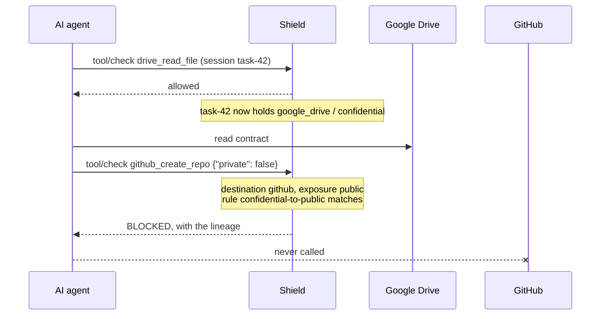

# Cross-App Flow Control
{: .no_toc }

An agent with access to Google Drive, Salesforce, GitHub and Gmail can pass every
per-tool permission check and still leak data. It reads a confidential contract
(allowed), creates a public repository (allowed), and uploads the contract to it
(allowed). Each call is fine on its own. The sequence is the problem.

Cross-App Flow Control remembers what each agent session has read, where it read
it from, and how sensitive it is. It then judges every outgoing tool call by
where that call sends data.
{: .fs-6 .fw-300 }

<details open markdown="block">
<summary>Contents</summary>
{: .text-delta }
1. TOC
{:toc}
</details>

---

## How it works



```text
drive_read_file            ->  session remembers: google_drive, confidential
github_create_repo         ->  destination: github, exposure PUBLIC (private=false)
  {"private": false}           rule confidential-to-public: BLOCK
```

For a complete walkthrough with real requests and responses, see the
[end-to-end example](#end-to-end-example) at the end of this page.

A policy has three parts:

| Part | What it says | Example |
|---|---|---|
| **Apps** | Which tools belong to which application, and how sensitive the data read from it is | `drive_*` is Google Drive, confidential |
| **Exposure rules** | When a call sends data outside the company or to the public, judged from its arguments | `github_create_repo` with `private: false` is public |
| **Flow rules** | What may not travel where: block, require approval, or warn | Confidential data may never go to a public destination |

Classifications, lowest to highest: `public`, `internal`, `confidential`,
`restricted`. Exposure, lowest to highest: `internal`, `external`, `public`.

Data that DLP detects in a tool result (SSN, card number, secret, PII) is
remembered too, whatever app it came from. So a rule on the `SSN` tag catches an
SSN that surfaced in any tool.

### Why the session, not the content

Once an agent has summarised a document, the text it sends onward no longer
matches the original, so content matching cannot prove where it came from.
Shield treats the session as the unit instead: once a session has read
confidential data, its outbound calls are judged as carrying it. This is
deliberate. Use `warn` or `require_approval` where that is stricter than you
want.

## Where it is enforced

The same policy applies on every path an agent's tool call goes through Shield:

| Path | Behaviour |
|---|---|
| `POST /v1/shield/tool/check` | Adds a `cross_app_flow` result. Block, warn, or `pending_confirmation` with an approval request id. |
| `POST /v1/shield/tool/output` | Records the tool's app and any DLP-detected tags for the session. |
| MCP gateway `tools/call` | Same decision. `require_approval` is a block here, because MCP cannot carry an approval grant. Use `/tool/check` for approvable actions. |
| `POST /v1/shield/auth/cap/mint` | Refuses the capability (403). For approvals it returns the usual `approval_required` response and accepts the signed grant. |

Calls that do not go through Shield (a direct SaaS API call) are not seen.

## Quick start

### 1. Load the starter policy in monitor mode

In the portal, open **Enterprise Controls > Cross-App Flow**. The starter
template is loaded when no policy is saved.

- Edit the Gmail domain list (`example.com`) to your own domains.
- Adjust the tool names to match your agents' tools.
- Click **Save policy**.

The template ships in `monitor` mode: it reports what it would block and
blocks nothing.

The same through the API:

```bash
curl -s https://YOUR_SHIELD/v1/tenant/me/flow-control/template -H "X-API-Key: $KEY" | jq .policy > flow.json
curl -s -X PUT https://YOUR_SHIELD/v1/tenant/me/flow-control/policy -H "X-API-Key: $KEY" -H "Content-Type: application/json" -d @flow.json
```

### 2. Try flows before they happen

Use **Try a flow** in the portal, or `POST /simulate`. It decides exactly as
enforcement would, and touches no session.

```bash
curl -s -X POST https://YOUR_SHIELD/v1/tenant/me/flow-control/simulate \
  -H "X-API-Key: $KEY" -H "Content-Type: application/json" \
  -d '{"tool_name": "github_create_repo", "tool_params": {"private": false},
       "sources": [{"tool_name": "drive_read_file"}]}'
```

### 3. Watch monitor-mode findings, then enforce

Monitor findings appear as `cross_app_flow` results with action `log` and a
message starting `[monitor] would block`. They show up in the decision audit,
telemetry and SIEM feeds like every other guardrail result.

When you are satisfied, set `"mode": "enforce"` and save.

### 4. Run the self-test

Run this against any environment. It saves the tenant's existing policy, runs
the scenarios with a temporary agent, and restores everything:

```bash
python scripts/test_cross_app_flow.py --base-url https://YOUR_SHIELD --api-key $KEY
```

## Sending tool calls

Agents must send a stable `session_id` for the task on every call. That is what
links a read to a later write.

```bash
# The agent reads a document: allowed, and the session now holds confidential Drive data.
curl -s -X POST https://YOUR_SHIELD/v1/shield/tool/check -H "X-API-Key: $KEY" -H "Content-Type: application/json" \
  -d '{"agent_key": "research-bot", "tool_name": "drive_read_file", "tool_params": {"file_id": "contract-9281"}, "session_id": "task-42"}'

# Same session, public repository: blocked.
curl -s -X POST https://YOUR_SHIELD/v1/shield/tool/check -H "X-API-Key: $KEY" -H "Content-Type: application/json" \
  -d '{"agent_key": "research-bot", "tool_name": "github_create_repo", "tool_params": {"name": "dump", "private": false}, "session_id": "task-42"}'
```

The blocked response carries the evidence:

```json
{
  "allowed": false,
  "action": "block",
  "guardrail_results": [{
    "guardrail": "cross_app_flow",
    "passed": false,
    "action": "block",
    "message": "Cross-app flow blocked by rule 'confidential-to-public': confidential data from google_drive (drive_read_file) may not be sent to github (github_create_repo, public destination)",
    "details": {
      "destination": {"tool": "github_create_repo", "apps": ["github"], "exposure": "public"},
      "flow_violations": [{"rule_id": "confidential-to-public", "action": "block",
        "sources": [{"apps": ["google_drive"], "tool": "drive_read_file", "classification": "confidential",
                     "evidence": "authorized", "scope": "session"}]}],
      "lineage": ["confidential data from google_drive (drive_read_file) -> github (github_create_repo, public destination)"]
    }
  }]
}
```

MCP servers behind the gateway can be placed in an app by route, as well as by
tool name. Add `"routes": ["drive-mcp"]` to the app. `/tool/check` accepts an
optional `route` field for the same purpose.

## Approvals

A rule with `"action": "require_approval"` holds the call on `/tool/check`:

1. The response is `"action": "pending_confirmation"`, with
   `details.request_id`. Retrying the same call reuses the same request, so
   approvers are not paged once per retry.
2. An approver approves it in the portal (**Operations Center > Pending
   Approvals**) or with
   `POST /v1/tenant/me/agentic/approvals/{request_id}/approve`. The response
   carries a signed `approval_grant`.
3. The agent repeats the call with `"approval_grant": "<grant>"`. The grant is
   bound to the exact tool, arguments and session, and works once. A grant for
   one email cannot send a different one.

`approval_request_id` is accepted too. The call's arguments must match what was
approved.

## Policy reference

```json
{
  "enabled": true,
  "mode": "enforce",
  "fail_closed": false,
  "session_ttl_seconds": 3600,
  "principal_scope": "agent_user",
  "principal_window_seconds": 3600,
  "default_exposure": "internal",
  "tag_classifications": {"PHI": "restricted"},
  "apps": {
    "google_drive": {"tools": ["drive_*", "drive.*"], "routes": ["drive-mcp"], "classification": "confidential"},
    "salesforce": {"tools": ["salesforce_*"], "classification": "confidential",
                   "source_tools": ["salesforce_get*", "salesforce_query*"]},
    "public_web": {"tools": ["pastebin_*"], "exposure": "public"}
  },
  "exposure_rules": [
    {"tools": ["github_create_repo*"], "param": "private", "equals": false, "exposure": "public"},
    {"apps": ["gmail"], "param": "*", "domain_not_in": ["acme.com"], "exposure": "external"}
  ],
  "rules": [
    {"id": "confidential-to-public", "source": {"min_classification": "confidential"},
     "destination": {"exposure": ["public"]}, "action": "block"},
    {"id": "customer-data-external", "source": {"apps": ["salesforce"]},
     "destination": {"exposure": ["external"]}, "action": "require_approval", "min_approvals": 2}
  ]
}
```

| Field | Meaning |
|---|---|
| `mode` | `enforce` or `monitor` (report only). |
| `fail_closed` | If the session store cannot be read when a rule applies: `false` allows with an advisory result, `true` blocks. |
| `session_ttl_seconds` | How long a session remembers a read (60 to 86400). |
| `principal_scope` | Also remember reads per principal, so a new session id does not forget them. `agent_user` (default): per agent and verified user, when the user is known. `agent`: per agent, which is strict and suits single-purpose agents; a shared agent serving many users would carry one user's reads into another's session. `off`: session only. |
| `default_exposure` | Exposure of a call no rule escalates. |
| `tag_classifications` | Classification of DLP tags. Defaults: `SSN` and `credit_card` restricted, `secret` and `PII` confidential. |
| `apps.*.tools` / `routes` | Tool-name globs (case-insensitive) and MCP routes. A call belongs to every app it matches. |
| `apps.*.classification` | Sensitivity of data read from the app. Without it, the app is only a destination. |
| `apps.*.source_tools` | Only these tools of the app count as reads (default: all of them). |
| `apps.*.exposure` | Baseline exposure of calls to the app. |
| `exposure_rules[].param` | Argument path (`a.b.0`), `*` for every argument, or `$resource` (cap/mint resource). |
| Exposure operators | One per rule: `equals`, `not_equals`, `in`, `not_in`, `matches` (regex), `domain_in`, `domain_not_in`, `missing`. A list argument matches when any element does. `"false"` equals `false`. |
| `rules[].source` | Any of `apps`, `classifications`, `min_classification`, `tags`. |
| `rules[].destination` | Any of `apps`, `tools` (globs), `exposure`. Every field set must match. |
| `rules[].action` | `block`, `require_approval` or `warn`. When several rules fire, the strongest wins. |
| `rules[].message` | Optional message returned instead of the generated one. |
| `rules[].min_approvals`, `approval_ttl_seconds` | For `require_approval`. |

Validation is strict. An unknown field, a rule naming an app that is not
defined, or an invalid regex is rejected with every error listed. A misspelled
field can never silently disable a rule.

The limits are:

- 200 apps
- 200 exposure rules
- 500 rules
- 50 entries per list

## API

All endpoints take the tenant API key (`X-API-Key`). They are served by both
the portal and the guardrail server.

| Method | Path | Purpose |
|---|---|---|
| GET | `/v1/tenant/me/flow-control/policy` | The saved policy, and whether it is enforced |
| PUT | `/v1/tenant/me/flow-control/policy` | Save (422 lists every validation error) |
| DELETE | `/v1/tenant/me/flow-control/policy` | Remove; enforcement stops |
| POST | `/v1/tenant/me/flow-control/validate` | Validate without saving |
| GET | `/v1/tenant/me/flow-control/template` | Starter policy |
| POST | `/v1/tenant/me/flow-control/simulate` | Decide a hypothetical call |
| GET | `/v1/tenant/me/flow-control/sessions/{session_id}` | What a session has read (audit view) |
| DELETE | `/v1/tenant/me/flow-control/sessions/{session_id}` | Forget a session's reads (audited) |

## Operations

- **Rollout.** Nothing changes for a tenant until it saves a policy. Every
  server picks up a saved policy within 5 seconds
  (`SHIELD_XFLOW_POLICY_CACHE_S`).
- **Who can change it.** Saving or deleting the policy and clearing a
  session follow the agent-registry write gate (`SHIELD_REGISTRY_WRITE_SCOPE`).
  Under `enforce`, only an admin-scoped API key or a signed-in portal
  administrator can make these changes. An agent's runtime key cannot erase its
  own session's record and then exfiltrate. Reading the policy, the simulator
  and the session view stay open to every tenant key.
- **Escape hatch.** `SHIELD_XFLOW=off` on the guardrail server turns the
  feature off for every tenant.
- **State.** Session records live in Redis, keyed by tenant:
  - `xflow:{tenant}:s:{session}`, expiring after `session_ttl_seconds`
  - `xflow:{tenant}:p:{principal}`
- **Latency.** A tenant with no policy pays nothing. A call that matches no
  rule's destination costs a few microseconds of matching. Only a call that
  matches a destination reads the session store (one Redis read), and only an
  allowed call to a classified app writes it.
- **Audit.** Every finding is a `cross_app_flow` guardrail result with the
  sources, destination and lineage. It flows into the decision audit,
  telemetry (including ASIM), webhooks and SIEM like any other guardrail.
  Policy changes and session clears are written to the admin audit log.

## End-to-end example

A contracts assistant helps the legal team. It can read Google Drive and
Salesforce, create GitHub repositories, and send mail. The company's rules:

- **Confidential data is never published.** Drive documents and Salesforce
  records are confidential.
- **Customer data may leave the company only with a human's approval.**

Everything below is a real run. Only the timestamps and ids differ from run to
run. Set these first:

```bash
SHIELD=https://YOUR_SHIELD
KEY=your-tenant-api-key
```

### 1. Register the agent and save the policy

The agent must be in the registry with the tools it uses, as for any tool call
through Shield:

```bash
curl -s -X POST $SHIELD/v1/agents/registry -H "X-API-Key: $KEY" -H "Content-Type: application/json" -d '{
  "agent_id": "contracts-agent",
  "tools": ["drive_read_file", "salesforce_get_account", "github_create_repo", "gmail_send"],
  "role_permissions": {"analyst": ["drive_read_file", "salesforce_get_account", "github_create_repo", "gmail_send"]}
}'
```

Save the policy. Replace `acme.com` with your own mail domains.

```bash
curl -s -X PUT $SHIELD/v1/tenant/me/flow-control/policy -H "X-API-Key: $KEY" -H "Content-Type: application/json" -d '{
  "enabled": true,
  "mode": "enforce",
  "apps": {
    "google_drive": {"tools": ["drive_*"], "classification": "confidential"},
    "salesforce":   {"tools": ["salesforce_*"], "classification": "confidential",
                     "source_tools": ["salesforce_get*", "salesforce_query*"]},
    "github":       {"tools": ["github_*"], "classification": "internal"},
    "gmail":        {"tools": ["gmail_*"]}
  },
  "exposure_rules": [
    {"tools": ["github_create_repo"], "param": "private", "equals": false, "exposure": "public"},
    {"tools": ["github_create_repo"], "param": "private", "missing": true, "exposure": "public"},
    {"apps": ["gmail"], "param": "*", "domain_not_in": ["acme.com"], "exposure": "external"}
  ],
  "rules": [
    {"id": "confidential-to-public", "description": "Confidential data is never published",
     "source": {"min_classification": "confidential"},
     "destination": {"exposure": ["public"]}, "action": "block"},
    {"id": "customer-data-external", "description": "Customer data leaving the company needs a human",
     "source": {"apps": ["salesforce"]},
     "destination": {"exposure": ["external"]}, "action": "require_approval"}
  ]
}'
```

{: .note }
On a live tenant, save with `"mode": "monitor"` first. Review what it would
block, then switch to `"enforce"`.

### 2. The agent reads a contract and a customer record

Every call carries the same `session_id` for the task:

```bash
check() {  # usage: check <tool> '<json params>' [extra JSON fields]
  curl -s -X POST $SHIELD/v1/shield/tool/check -H "X-API-Key: $KEY" -H "X-User-Role: analyst" \
    -H "Content-Type: application/json" \
    -d "{\"agent_key\": \"contracts-agent\", \"session_id\": \"task-42\", \"tool_name\": \"$1\", \"tool_params\": $2 ${3:+, $3}}"
}

check drive_read_file '{"file_id": "msa-globex-2026.pdf"}'
check salesforce_get_account '{"account_id": "001-GLOBEX"}'
```

Both are allowed (`"allowed": true`). Shield now knows session `task-42` holds
confidential data from `google_drive` and `salesforce`.

### 3. The agent tries to publish a summary publicly: blocked

```bash
check github_create_repo '{"name": "globex-contract-summary", "private": false}'
```

```json
{
  "allowed": false,
  "action": "block",
  "guardrail_results": [
    {
      "guardrail": "cross_app_flow",
      "passed": false,
      "action": "block",
      "message": "Cross-app flow blocked by rule 'confidential-to-public': confidential data from salesforce (salesforce_get_account) may not be sent to github (github_create_repo, public destination)",
      "details": {
        "destination": {"tool": "github_create_repo", "apps": ["github"], "exposure": "public"},
        "flow_violations": [
          {
            "rule_id": "confidential-to-public",
            "action": "block",
            "description": "Confidential data is never published",
            "source_count": 2,
            "sources": [
              {"apps": ["salesforce"], "tool": "salesforce_get_account", "classification": "confidential",
               "evidence": "authorized", "scope": "session"},
              {"apps": ["google_drive"], "tool": "drive_read_file", "classification": "confidential",
               "evidence": "authorized", "scope": "session"}
            ]
          }
        ],
        "lineage": [
          "confidential data from salesforce (salesforce_get_account) -> github (github_create_repo, public destination)",
          "confidential data from google_drive (drive_read_file) -> github (github_create_repo, public destination)"
        ]
      }
    }
  ]
}
```

(Shortened: the other guardrails' passing results are left out.)

### 4. A private repository is fine

```bash
check github_create_repo '{"name": "globex-contract-summary", "private": true}'
```

`"allowed": true`. The exposure is `internal`, so no rule applies. Leaving
`private` out would be blocked, because GitHub creates public repositories by
default.

### 5. Mailing the customer's lawyers: held for approval

```bash
check gmail_send '{"to": "legal@globex.com", "subject": "Contract summary", "body": "Summary attached"}'
```

```json
{
  "allowed": false,
  "action": "pending_confirmation",
  "guardrail_results": [
    {
      "guardrail": "cross_app_flow",
      "action": "pending_confirmation",
      "message": "Cross-app flow requires approval by rule 'customer-data-external': confidential data from salesforce (salesforce_get_account) may not be sent to gmail (gmail_send, external destination). Approval request apr_8c691964f2 is pending.",
      "details": {"request_id": "apr_8c691964f2", "required_approvals": 1}
    }
  ]
}
```

The same mail to `someone@acme.com` would go straight through, because it is
internal.

### 6. A person approves, and the agent sends

An approver approves it under **Operations Center > Pending Approvals** in the
portal, or through the API. Use the `request_id` from step 5:

```bash
RID=apr_8c691964f2   # the request_id from step 5
GRANT=$(curl -s -X POST $SHIELD/v1/tenant/me/agentic/approvals/$RID/approve \
  -H "X-API-Key: $KEY" -H "Content-Type: application/json" \
  -d '{"approver": "dana@acme.com", "reason": "Globex legal asked for it"}' | jq -r .approval_grant)
```

The approve response has `"status": "approved"` and a signed
`approval_grant`, kept here in `$GRANT`. The agent repeats the exact same call
with it:

```bash
check gmail_send '{"to": "legal@globex.com", "subject": "Contract summary", "body": "Summary attached"}' \
  "\"approval_grant\": \"$GRANT\""
```

`"allowed": true`, with the message `Cross-app flow approved by signed grant`.

The grant works once and only for these arguments:

- Sending it again is refused with `approval replay detected (nonce already
  used)`.
- Changing the recipient or body is refused with `arguments changed since
  approval`.

### 7. The audit trail

The session view shows what the agent had read when each decision was made:

```bash
curl -s $SHIELD/v1/tenant/me/flow-control/sessions/task-42 -H "X-API-Key: $KEY"
```

```json
{
  "session_id": "task-42",
  "count": 3,
  "records": [
    {"tool": "drive_read_file", "apps": ["google_drive"], "classification": "confidential",
     "evidence": "authorized", "path": "tool_check", "at": 1790605193.65},
    {"tool": "salesforce_get_account", "apps": ["salesforce"], "classification": "confidential",
     "evidence": "authorized", "path": "tool_check", "at": 1790605193.66},
    {"tool": "github_create_repo", "apps": ["github"], "classification": "internal",
     "evidence": "authorized", "path": "tool_check", "at": 1790605193.70}
  ]
}
```

The block in step 3 and the approval in step 5 are also in the decision audit,
telemetry and SIEM feeds, as `cross_app_flow` results.

The same scenario, with pass/fail checks and automatic cleanup, is what
`scripts/test_cross_app_flow.py` runs.
