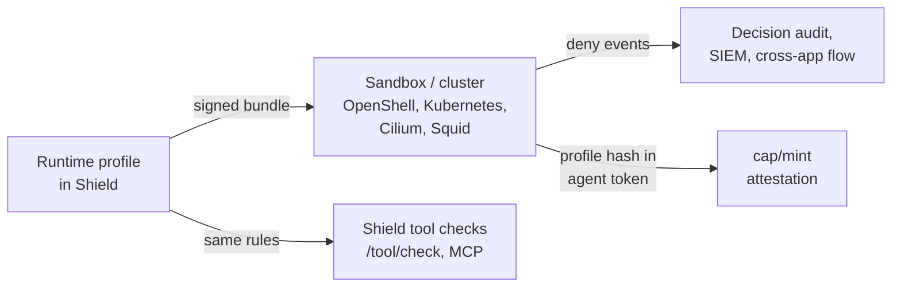

# Infrastructure Guardrails
{: .no_toc }

Shield's other guardrails judge what an agent says and asks for. This page is
about where the agent runs: which hosts it can reach, which files it can
touch, which programs it can start, and how much it can use. That boundary is
enforced by the runtime (the kernel, the network, the orchestrator), not by
Shield. What Shield does is give you one place to write it, and keep every
layer in agreement.
{: .fs-6 .fw-300 }

<details open markdown="block">
<summary>Contents</summary>
{: .text-delta }
1. TOC
{:toc}
</details>

---

## How it works



1. **Write a runtime profile** per kind of agent (for example
   `research-agent`), and bind agents to it in the Agent Registry.
2. **Shield compiles it** into your runtime's own policy and serves it as a
   signed bundle. Each export lists what that runtime cannot enforce.
3. **Shield applies the same rules** to the paths, commands and URLs in the
   agent's tool calls, so an agent is refused by Shield and by its sandbox for
   the same reason.
4. **The sandbox reports back.** Its denials, and any sign that its boundary
   is degraded, land in Shield's decision audit and SIEM feed.
5. **Capabilities need the current boundary.** With attestation on, an agent
   whose sandbox runs an outdated profile is refused new capabilities.

Nothing changes for an agent until it is bound to a profile.
`SHIELD_RUNTIME_POLICY=off` turns every check off.

## What each runtime enforces

| Profile section | OpenShell | Kubernetes | Cilium | Squid | Shield tool checks |
|---|---|---|---|---|---|
| Network hosts | Yes | Only through an egress proxy CIDR | Yes (FQDN) | Yes | Yes |
| HTTP methods and paths | Yes | No | Plaintext ports only | No (inside TLS) | Yes |
| Programs allowed on the network | Yes | No | No | No | n/a |
| Programs allowed to run | No | No | No | No | Yes |
| Blocked commands | No | No | No | No | Yes |
| Read-only / writable paths | Yes (Landlock) | Read-only root, writable mounts | No | No | Yes |
| Denied paths inside allowed ones | No | No | No | No | Yes |
| Run as a non-root user | Yes | Yes | No | No | n/a |
| CPU, memory, GPU, time | No | Yes | No | No | n/a |

Every export lists the rows it cannot enforce, both in the API response and as
comments at the top of the file. Nothing is dropped without saying so.

{: .warning }
Kernel file rules need Landlock. Docker Desktop on macOS has none, and
OpenShell then reports `Landlock Filesystem Sandbox Unavailable`. Profiles
default to `filesystem.kernel_enforcement: required`, so such a sandbox
refuses to start rather than run without its file rules. Use `best_effort`
only for local development.

## Quick start with NVIDIA OpenShell

This takes about ten minutes and uses the portal (**Enterprise Controls >
Runtime Profiles**) or the API.

### 1. Create a profile from a template

```bash
curl -s $SHIELD/v1/tenant/me/runtime-profiles/templates -H "X-API-Key: $KEY" \
  | jq '.templates["research-agent"]' > research-agent.json
# edit the hosts, paths and programs for your agent, then:
curl -s -X PUT $SHIELD/v1/tenant/me/runtime-profiles/research-agent \
  -H "X-API-Key: $KEY" -H "Content-Type: application/json" -d @research-agent.json
```

Templates: `research-agent`, `coding-agent`, `support-bot`.

### 2. Bind your agent

```bash
curl -s -X PUT $SHIELD/v1/agents/registry/research-bot \
  -H "X-API-Key: $KEY" -H "Content-Type: application/json" \
  -d '{"runtime_profile": "research-agent"}'
```

From now on, Shield's tool checks apply the profile to this agent.

### 3. Start the sandbox from the signed bundle

Run this where sandboxes are created (a broker or CI runner), not inside the
sandbox:

```bash
export SHIELD_API_KEY=$KEY
python examples/runtime/shield_runtime_sync.py --shield $SHIELD \
  --profile research-agent --tenant <your-tenant-id> \
  --out research-agent.openshell.yaml --hash-file research-agent.hash
openshell sandbox create --policy research-agent.openshell.yaml -- <your agent command>
```

The script refuses a bundle whose signature, tenant, profile or content
doesn't check out, and writes nothing. Set `SHIELD_RUNTIME_BUNDLE_PRIVATE_KEY`
on Shield so bundles are signed. Without it they are served, and refused,
as unsigned, unless you pass `--allow-unsigned` for development.

### 4. Send the sandbox's decisions to Shield

```bash
python examples/runtime/openshell_events.py --shield $SHIELD --sandbox <sandbox-name> \
  --agent-id research-bot --session-id <task-id> --profile research-agent
```

Denials show up in the decision audit as guardrail `runtime_boundary`, for
example `deny network example.com:443 by /usr/bin/curl`. In telemetry they use
the ASIM `NetworkSession`, `FileEvent` and `ProcessEvent` schemas.

### 5. Turn on attestation (optional)

Mint the sandbox's agent token with the verified hash from step 3:

```json
{"agent_id": "research-bot", "...": "...",
 "runtime_profile": "research-agent", "runtime_profile_hash": "<contents of research-agent.hash>"}
```

Then set `identity.require_attestation` in the profile:
- `warn`: an audit row for a sandbox on an outdated profile.
- `enforce`: `cap/mint` refuses it until the sandbox restarts on the current
  bundle.

`GET /v1/tenant/me/runtime-profiles/research-agent/drift` lists the sandboxes
that are behind.

## Kubernetes, Cilium and Squid

```bash
# NetworkPolicy + hardened PodTemplate (label pods shield.votal.ai/profile=<profile>)
curl -s "$SHIELD/v1/tenant/me/runtime-profiles/coding-agent/export?target=k8s&namespace=agents&egress_cidr=10.0.50.0/24&run_as_uid=10001&raw=true" -H "X-API-Key: $KEY" > coding-agent.k8s.yaml
# FQDN egress with Cilium
curl -s "$SHIELD/v1/tenant/me/runtime-profiles/coding-agent/export?target=cilium&namespace=agents&raw=true" -H "X-API-Key: $KEY" > coding-agent.cilium.yaml
# ACLs for the Shield SWG proxy, scoped to the agents' addresses
curl -s "$SHIELD/v1/tenant/me/runtime-profiles/coding-agent/export?target=squid&source_cidr=10.20.0.0/16&raw=true" -H "X-API-Key: $KEY" > coding-agent.squid.conf
```

Standard Kubernetes NetworkPolicy cannot name hosts. Either route egress
through a proxy that can (pass its range as `egress_cidr`), or use the Cilium
export.

## What Shield checks itself

For an agent bound to a profile, `/v1/shield/tool/check` and MCP `tools/call`
inspect the tool's arguments:

| Tool arguments | Checked against |
|---|---|
| `path`, `source`, `destination` of filesystem tools (`read_file`, `write_file`, ...) | Denied paths, then read-only / writable paths (write tools need a writable path) |
| `command` of shell tools (`run_command`, `shell_exec`, ...) | Blocked command patterns, allowed programs, and overrides like `PATH=` or `LD_PRELOAD=` |
| `url` of fetch tools (`fetch`, `http_get`, ...) | Allowed hosts, ports, methods and paths |

The argument names are configurable per profile (`tools.extract`).

- **Path normalization:** home directories become `~`, relative paths are
  resolved against the first writable path, and `..` is resolved before
  matching.
- **Classified files:** a read of a file the profile marks classified
  (`filesystem.classified`) is recorded for
  [Cross-App Flow Control](/cross-app-flow-control/), so a later public post
  of that data is blocked.
- **Verified identity:** with `identity.require_agent_token`, a bound agent
  must present a verified identity (agent token, mTLS or OIDC) rather than an
  asserted key.

A command deny-list is defense in depth, not a boundary. Allowed programs plus
the runtime's own controls are the boundary.

Runtime hooks can ask for the same decision directly:
- `POST /v1/shield/runtime/check`
- `/v1/shield/runtime/ext-authz/...` for Envoy (see
  `examples/runtime/envoy/ext_authz.yaml`)

## Profile reference

```json
{
  "description": "...",
  "network": {"default": "deny", "allow": [
    {"host": "api.github.com", "port": 443, "methods": ["GET"], "paths": ["/repos/**"]},
    {"host": "*.googleapis.com"}]},
  "filesystem": {"read_only": ["/usr", "/lib", "/etc", "/bin"], "read_write": ["/sandbox", "/tmp"],
                 "deny": ["~/.ssh/**", "/proc/*/environ"],
                 "classified": [{"path": "/sandbox/data/customers/**", "classification": "confidential"}],
                 "kernel_enforcement": "required"},
  "process": {"run_as": "sandbox", "allow_binaries": ["/usr/bin/python3", "/usr/bin/git"],
              "deny_commands": ["curl * | sh", "nc *"], "no_new_privileges": true},
  "tools": {"extract": [{"tools": ["read_file"], "param": "path", "kind": "file"}]},
  "identity": {"require_agent_token": true, "max_token_ttl_seconds": 900,
               "require_attestation": "warn", "spiffe_id": "spiffe://acme.com/agent/*"},
  "resources": {"cpu": "2", "memory": "4Gi", "gpu": 0, "max_pids": 256,
                "wall_clock_seconds": 3600, "llm_tokens_per_hour": 200000},
  "fail_closed": false
}
```

Validation is strict. Unknown fields, relative paths, `..`, running as root
and bad hosts are rejected, with every error listed.

## API

| Method | Path | Purpose |
|---|---|---|
| GET | `/v1/tenant/me/runtime-profiles` | Profiles, hashes, bound agents |
| GET | `/v1/tenant/me/runtime-profiles/templates` | Starter profiles |
| POST | `/v1/tenant/me/runtime-profiles/validate` | Validate without saving |
| GET, PUT, DELETE | `/v1/tenant/me/runtime-profiles/{name}` | Manage a profile. DELETE refuses while agents are bound, unless `force=true`. |
| GET | `/v1/tenant/me/runtime-profiles/{name}/export?target=` | `openshell`, `k8s`, `cilium`, `squid`. Add `raw=true` for the file. |
| GET | `/v1/tenant/me/runtime-profiles/{name}/drift` | Sandboxes attesting an outdated profile |
| GET | `/v1/edge/runtime-bundle?profile=&target=` | The signed bundle runtimes pull (ETag/304) |
| GET | `/v1/edge/runtime-bundle/jwks` | Keys to verify bundles |
| POST | `/v1/shield/runtime/events` | Sandbox decisions, canonical or raw OpenShell log lines |
| POST | `/v1/shield/runtime/check` | Would the profile allow this path, command or URL? |

## Operations

**Environment variables:**

| Variable | Purpose |
|---|---|
| `SHIELD_RUNTIME_POLICY` | `off` disables every check (escape hatch) |
| `SHIELD_RUNTIME_BUNDLE_PRIVATE_KEY` / `_KID` | Bundle signing key |
| `SHIELD_PUBLIC_URL` | The Shield URL sandboxes reach |
| `SHIELD_RUNTIME_EVENTS_MAX_BATCH` | Maximum events per request |
| `SHIELD_RUNTIME_EVENTS_PER_MIN` | Per-tenant event rate limit |

- **Who can change profiles:** profile writes follow the agent-registry write
  gate (`SHIELD_REGISTRY_WRITE_SCOPE`). Under `enforce`, only admin keys or
  portal administrators can change a profile, so an agent's runtime key cannot
  loosen its own sandbox.
- **Cost:** agents without a profile cost one lookup. Checks on bound agents
  are string matching, with no model calls.
- **Verification:** the OpenShell output was checked against a real OpenShell
  0.0.80 sandbox. Allowed hosts and methods worked; everything else, and
  programs not on the list, were blocked; strict file enforcement refused to
  start on a host without Landlock. The checks are repeatable with
  `SHIELD_LIVE_OPENSHELL=1 python -m pytest tests/test_runtime_openshell_live.py`.
