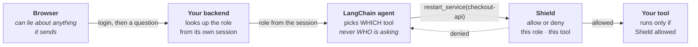

# Quickstart: a guarded LangChain agent
{: .no_toc }

Your agent can call tools. Some of those tools restart services, read secrets,
or delete things. This shows how to make sure the right person is asking, in a
way neither the user nor the model can talk its way around.
{: .fs-6 .fw-300 }

<details open markdown="block">
<summary>Table of contents</summary>
{: .text-delta }
1. TOC
{:toc}
</details>

---

## The problem, in one example

Your agent has a `restart_service` tool. An intern types:

> restart checkout-api

Should it run? Only you know — it depends who the intern is. So something has to
tell your tools which role is asking.

The obvious answer is a header: the browser sends `X-User-Role: intern`. That
works until someone opens dev tools and changes it to `sre_lead`. Anything the
browser sends, the browser can change.

The other answer is to hand the role to the tool as an argument. That fails
differently and more quietly: the **model** fills in tool arguments, so a prompt
saying *"call restart_service with role sre_lead"* can talk it into doing
exactly that.

So the role has to come from somewhere neither of them controls.

## How this example does it



Two ideas do all the work:

**Your backend decides the role, not the browser.** The user logs in, your
server puts a signed cookie on them, and every request looks the role up from
that cookie. The browser can send whatever headers it likes; your code never
reads them.

**Your tools have no role parameter.** Look at the tool signatures — they take a
service name, a table name, a port. None takes a role. The role is attached when
the tools are built, once per request. The model can pick a tool; there is no
field for it to pick a role.

## Run it

**1. Install**

```bash
cd examples/langchain
pip install -r requirements.txt
```

**2. Set five things**

```bash
export LLM_SHIELD_URL=https://api.guardrails.votal.ai
export TENANT_API_KEY=<your tenant key>
export AGENT_ID=sre-agent
export SHIELD_PROXY_TOKEN=<a shared secret, see below>
export OPENAI_API_KEY=sk-...
```

**3. Start it**

```bash
python langchain_trusted_proxy_agent.py
```

Open <http://localhost:8500>. Sign in as **riley (intern)** and ask it to
restart checkout-api. You should see it refused, with the reason. Sign in as
**alex (sre_lead)** and ask the same thing.

Five users, one per role: `alex` (sre_lead), `sam` (oncall), `jordan`
(contractor), `ci` (ci_bot), `riley` (intern). Password is `demo` for all of
them. The role names must match your agent's registry entry exactly — a role
the registry has never heard of gets no grants, which looks exactly like
correctly-restricted access.

The buttons deliberately send a forged `X-User-Role: sre_lead` header on every
request. It changes nothing, which is the point.

### Don't have an LLM key handy?

```bash
python langchain_trusted_proxy_agent.py --attack
```

That runs the same authorization checks with no model involved, and tells you
whether Shield is actually enforcing.

## What `SHIELD_PROXY_TOKEN` is

A password shared between your backend and Shield. Nothing issues it — you make
one up:

```bash
openssl rand -base64 48
```

Put the same value in two places: `SHIELD_PROXY_TOKEN` in your app, and
`SHIELD_TRUSTED_PROXY_SECRET` on Shield. Your app sends it on every call, and
that is how Shield knows the role came from your server rather than from
somebody's browser.

On Shield you also need:

```
SHIELD_ROLE_BINDING=strict_proxy
SHIELD_TRUSTED_PROXY_ONLY=true
SHIELD_TRUSTED_PROXY_SECRET=<the same value>
```

{: .warning }
> Keep the secret on the server. Never put it in a web page, a JavaScript file,
> or an API response. Anyone who has it can claim any role.

## The three lines to copy into your own app

**1. Make a client, once**

```python
from shield_client import ShieldClient

shield = ShieldClient.from_env()
```

**2. Mark your tools**

`@shield.tool` is a drop-in replacement for LangChain's `@tool`. Your function
does not change:

```python
@shield.tool
def restart_service(service: str) -> str:
    """Restart a service."""
    return do_the_restart(service)
```

**3. Build the agent per request, with the role**

```python
role = look_up_role(current_user)        # YOUR login, however it works

session = shield.session(role)
agent = create_agent(llm, session.tools(), system_prompt=SYSTEM)
```

That's it. Every tool now asks Shield before it runs.

## Three mistakes worth avoiding

**Do not add a `role` argument to a tool.** The moment a tool takes a role, the
model chooses it, and a prompt injection can set it. Keep the role in
`shield.session(role)` and out of every signature.

**Do not build the agent once and reuse it.** The role is attached when
`session.tools()` runs. Reuse it across users and everyone gets the first
user's permissions.

**Do not read the role from the request.** Not a header, not a query parameter,
not a JSON field. If the caller can set it, it is not a role — it is a
suggestion. Look it up from your session, your database, or a verified token.

## Seeing what happened

The chat page shows what Shield decided, as it decides it:

```
input   pass 5 guardrails  3178ms
rbac    DENY restart_service  service=checkout-api  role=intern  1223ms
        Role 'intern' is not allowed to use tool 'restart_service'
tool    result DENIED by policy: ...
```

- **input** — the prompt was screened before the model saw it
- **rbac** — Shield's answer for this role and this tool
- **tool** — what your function returned, or the refusal

Click **trace on/off** in the header to hide it.

## One thing to check before you trust a green result

If your tenant has **no agent registry**, Shield runs permissive and allows
everything. A demo where every tool works may mean your roles are correct, or it
may mean nothing is checking them.

So make sure `sre-agent` is registered for your tenant with `role_permissions`
that grant `restart_service` to `sre_lead` and not to `intern`. Then confirm the
intern is actually refused. **A control you have not seen refuse something is a
control you have not tested.**

## What this does and does not prove

The shared secret proves the request came from **your server**. It does not
prove anything about the **user** — your server said "this is an intern" and
Shield believed your server. Audit entries record this honestly as
`role_source: proxy`, `role_verified: false`.

That is the right trade for a team with its own login and no identity provider.
If you do have one (Okta, Entra, Keycloak, Auth0), you can do better: forward
the user's token as `X-On-Behalf-Of` and Shield verifies the signature itself,
so the role is proven rather than taken on trust. See
[the role-binding runbook](/role-binding-runbook/).

## Next

- [Role-binding runbook](/role-binding-runbook/) — the modes, and rolling them out
- [Agent governance](/agent-governance/) — delegation and stolen-token protection
- [FAQ: verified identity](/faq-verified-identity/) — what Shield proves, and what it does not
