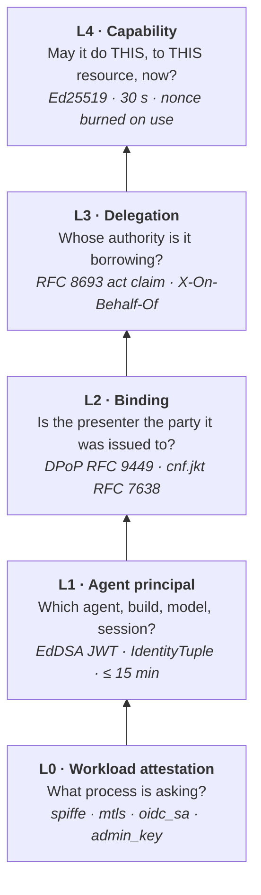
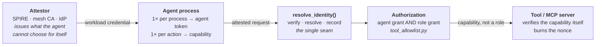

# Non-human identity
{: .no_toc }

An agent has no password, no MFA prompt, and nobody at the keyboard when it
acts. Every access control that assumes a human is present degrades quietly the
moment an agent is the one calling.

Shield replaces those assumptions with five layers. Each answers exactly one
question, each maps to one module, and each can be enabled independently.
{: .fs-6 .fw-300 }

<details open markdown="block">
<summary>Table of contents</summary>
{: .text-delta }
1. TOC
{:toc}
</details>

---

## Why a service account is not the answer

The reflex is to give the agent a service account. That reproduces every
property you were trying to avoid:

| Service account | What an agent needs |
|---|---|
| Lives for months | Expires in minutes, because the agent acts in seconds |
| Shared by every process | Distinguishes agent, build, model version, and session |
| Asserts its own role | Carries a role signed by something the agent cannot forge |
| Bearer credential | Useless to whoever steals it |
| Coarse scope (an API, a database) | One tool, one resource, one use |

Long-lived shared bearer credentials are survivable for humans because a human
acts slowly and notices when something is wrong. Neither is true of an agent in
a loop.

---

## The five layers

Read bottom-up. **Every layer above L0 is a claim until something at L0 is
verified**. A capability scoped to `billing-bot` proves nothing if
`billing-bot` was asserted in a header.



| Layer | Question | Module | Default |
|---|---|---|---|
| **L4** Capability | May it do this specific thing, to this specific resource, right now? | `core/capabilities.py` | on |
| **L3** Delegation | Whose authority is it borrowing? | `core/delegation.py` | **off** |
| **L2** Binding | Is the presenter the party this was issued to? | `core/dpop.py` | **off** |
| **L1** Agent principal | Which agent, build, model, session? | `core/agent_tokens.py` | on |
| **L0** Workload attestation | What process is asking, and did the platform vouch for it? | `core/workload_identity/` | 2 of 4 providers |

All five converge on one function, `resolve_identity()` in
`core/identity_resolution.py`. It is the only place identity is decided, and it
records the **provenance** of every field it returns: `agent_source`,
`role_source`, `binding`, `acting_for`. That provenance is what makes the
difference between "a token was present" and "a token was used".

A richer version of this diagram, including the request path and rollout
sequence, is at
[the NHI topology page](/nhi-topology.html){: target="_blank"}, built for
security operations review.

---

## The request path



Two properties matter here:

**Authorization is an intersection.** `tool_allowlist.py` enforces *agent AND
role*. Neither the agent nor the user it acts for can exceed its own grant, so
delegation can only ever narrow authority.

**The tool server does not trust the caller.** It receives a signed capability
naming one tool and one resource, verifies the Ed25519 signature against
Shield's public key, and burns the nonce. A replayed capability fails at the
tool, not just at the gateway.

---

## Lifetimes

Short lifetimes are the control that replaces revocation. You cannot revoke
fast enough to stop an agent mid-loop, so the credential must expire faster
than the damage compounds.

| Credential | Default | Hard cap | Scope | Revocation |
|---|---|---|---|---|
| Workload credential | issuer-set | issuer-set | the process | the attestor's rotation |
| Agent token | 10 min | **15 min** | agent + instance + session | by instance, by `jti`, by user |
| Capability | 30 s | **60 s** | one tool, one resource | nonce burned on first use |

The agent-token cap is enforced in `mint_agent_token()` regardless of what the
caller requests, so a client cannot widen its own window.

---

## What is on, and what you must turn on

{: .warning }
> Every default below fails **open and quiet**. A valid OIDC token sent to a
> default-configured Shield is not rejected. It is never read, and the header
> is used instead. The request succeeds. The only visible difference is
> `role_source` in the audit record.

| Control | Environment variable | Default | What the default means |
|---|---|---|---|
| Workload providers | `SHIELD_WORKLOAD_IDENTITY_PROVIDERS` | `admin_key,spiffe` | `oidc_sa` and `mtls` are **not** enabled |
| Role binding | `SHIELD_ROLE_BINDING` | `off` | The role comes from the `X-User-Role` header, chosen by the caller RBAC is constraining |
| Token binding | `SHIELD_TOKEN_BINDING` | `off` | Tokens are bearer; whoever holds one is the agent |
| Delegation | `SHIELD_DELEGATION` | `off` | No user is bound to the action |

These are off by default deliberately: each changes who is allowed to do what,
and turning one on without migrating callers first will start refusing traffic
that used to pass.

---

## Verifying it, rather than assuming it

The check that matters is **not** "does a valid token work". It is **does an
invalid one fail**.

Present a signed token *alongside a forged role header* and confirm the signed
claim wins:

```bash
KC_USER=alice FORGED_ROLE=payments_officer \
  python examples/langchain/keycloak_binding_demo.py
```

```
1. Keycloak issued a token
   roles  ['customer_support']
2. Shield verifies it
   verified by provider oidc_sa, trust=high
3. The same request, also claiming X-User-Role: payments_officer
   SHIELD_ROLE_BINDING=off     role=payments_officer  source=header  the forged header won
   SHIELD_ROLE_BINDING=prefer  role=customer_support  source=oidc    the signed claim won
```

For a deployed data plane, `examples/langchain/verify_deployment.py` reports
role provenance and exits non-zero when a layer is configured but not actually
enforcing.

---

## Rollout order

Each step is safe on its own. Taken out of order, step 4 refuses live traffic.

| # | Step | Why this order |
|---|---|---|
| 1 | Enable the workload provider you actually use (`oidc_sa` for Keycloak or Kubernetes service accounts, `spiffe` for a mesh) | Nothing above L0 can be verified until something at L0 is. This alone changes no decision, so it ships safely first. |
| 2 | `SHIELD_ROLE_BINDING=prefer` | Signed claims start winning over headers. `prefer` falls back to the header when no claim exists, so unmigrated callers keep working. |
| 3 | Watch `role_source` in the audit log | Every caller still reporting `header` has not migrated. This is the list you need before step 4. |
| 4 | `strict` / `required` | Unverified claims are refused. Safe only once step 3 comes back empty. |

Steps 1 to 3 are non-breaking by construction. Step 4 is the one that requires
the audit evidence from step 3.

---

## Related

- [Workload Identity (SPIRE)](/workload-identity-bundle/): on-prem attestation as opt-in containers
- [Identity Provider Interoperability](/idp-interoperability/): Keycloak, Okta, Entra, Auth0
- [Continuous Identity & Auto-Revoke](/continuous-identity/): CAEP/SSF signals and closed-loop revoke
- [Spec: Token binding](/spec-token-binding/): the proof-of-possession design
- [Role-Based Access (RBAC)](/rbac/): how the agent and role grants intersect
