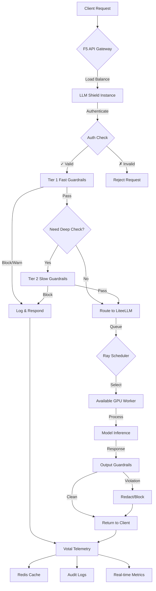

# LLM Shield Guardrails - On-Premises Deployment Guide
## RedHat Enterprise + H200 GPU Infrastructure

### 📋 Executive Summary

This document provides comprehensive guidance for deploying LLM Shield Guardrails in an on-premises environment using RedHat Enterprise Linux with NVIDIA H200 GPUs via MIG (Multi-Instance GPU) slicing. The deployment supports government and enterprise environments requiring air-gapped operation with multi-tenant security controls.

---

## 🏗️ Application Architecture

### Complete System Architecture

```
┌─────────────────────────────────────────────────────────────────────────────────────────┐
│                            Government Internal Network (GIN)                              │
├─────────────────────────────────────────────────────────────────────────────────────────┤
│                                    Client Layer                                          │
│  ┌─────────────┐┌─────────────┐┌─────────────┐┌─────────────┐┌─────────────┐┌───────────┐ │
│  │   RTA App   ││   DP App    ││  DEWA App   ││Municipal App││    DH App   ││Courts App │ │
│  │(Transport)  ││(Police)     ││(Utilities)  ││(Municipal)  ││(Health)     ││(Justice)  │ │
│  │             ││             ││             ││             ││             ││   100+    │ │
│  └─────────────┘└─────────────┘└─────────────┘└─────────────┘└─────────────┘└───────────┘ │
│         │               │               │               │               │           │     │
│         └───────────────┼───────────────┼───────────────┼───────────────┼───────────┘     │
│                         │               │               │               │                 │
├─────────────────────────┼───────────────┼───────────────┼───────────────┼─────────────────┤
│                     ┌─────────────────────────────────────────────────────┐               │
│                     │              PA Firewall                            │               │
│                     │  • Rate Limiting • DDoS Protection • SSL Offload    │               │
│                     └─────────────────────────────────────────────────────┘               │
├─────────────────────────────────────────────────────────────────────────────────────────┤
│                                   AI Factory                                             │
│ ┌─────────────────────────────────────────────────────────────────────────────────────┐ │
│ │                              API Gateway Layer                                     │ │
│ │  ┌─────────────────────────────────────────────────────────────────────────────┐   │ │
│ │  │                        F5 API Gateway                                      │   │ │
│ │  │  • Load Balancing  • SSL Termination  • Authentication                     │   │ │
│ │  │  • Request Routing • Health Checks    • Circuit Breaker                    │   │ │
│ │  └─────────────────────────────────────────────────────────────────────────────┘   │ │
│ └─────────────────────────────────────────────────────────────────────────────────────┘ │
│                                          │                                               │
│ ┌─────────────────────────────────────────────────────────────────────────────────────┐ │
│ │                            Security & Guardrails Layer                             │ │
│ │                                                                                     │ │
│ │  ┌─────────────────────────────────────────────────────────────────────────────┐   │ │
│ │  │                    LLM Shield Guardrails Engine                            │   │ │
│ │  │                                                                             │   │ │
│ │  │  ┌─────────────┐    ┌─────────────┐    ┌─────────────┐                     │   │ │
│ │  │  │ TIER 1 FAST │    │ TIER 2 SLOW │    │   RBAC      │                     │   │ │
│ │  │  │  CPU-based  │    │ LLM-based   │    │ & Policies  │                     │   │ │
│ │  │  │   <5ms      │    │ 200-800ms   │    │             │                     │   │ │
│ │  │  │             │    │             │    │             │                     │   │ │
│ │  │  │• Keyword    │    │• Adversarial│    │• Multi-Tenant│                    │   │ │
│ │  │  │• PII        │    │• Safety     │    │• Rate Limits │                    │   │ │
│ │  │  │• Regex      │    │• Topic      │    │• Tool Access │                    │   │ │
│ │  │  │• Rate Limit │    │• Bias       │    │• Data Scope  │                    │   │ │
│ │  │  │• Sentiment  │    │• Factual    │    │• Audit Trail │                    │   │ │
│ │  │  └─────────────┘    └─────────────┘    └─────────────┘                     │   │ │
│ │  └─────────────────────────────────────────────────────────────────────────────┘   │ │
│ │                                          │                                           │ │
│ │  ┌─────────────────────────────────────────────────────────────────────────────┐   │ │
│ │  │                        Redis Cluster                                       │   │ │
│ │  │  • Tenant State   • Rate Limiting   • Session Management                   │   │ │
│ │  │  • Guardrail Cache • Real-time Metrics • Multi-tenant Isolation          │   │ │
│ │  │                                                                             │   │ │
│ │  │  [Master-1] ←→ [Master-2] ←→ [Master-3]                                    │   │ │
│ │  │      │              │              │                                       │   │ │
│ │  │  [Replica-1]   [Replica-2]   [Replica-3]                                  │   │ │
│ │  └─────────────────────────────────────────────────────────────────────────────┘   │ │
│ └─────────────────────────────────────────────────────────────────────────────────────┘ │
│                                          │                                               │
│ ┌─────────────────────────────────────────────────────────────────────────────────────┐ │
│ │                              Model Serving Layer                                   │ │
│ │                                                                                     │ │
│ │  ┌─────────────────────────────────────────────────────────────────────────────┐   │ │
│ │  │                         Lite LLM Gateway                                   │   │ │
│ │  │  • Model Routing    • Load Balancing   • Request Queuing                  │   │ │
│ │  │  • Token Management • Context Caching  • Fallback Handling                │   │ │
│ │  └─────────────────────────────────────────────────────────────────────────────┘   │ │
│ │                                          │                                           │ │
│ │  ┌─────────────────────────────────────────────────────────────────────────────┐   │ │
│ │  │                      Model Workers (llama.cpp)                             │   │ │
│ │  │                                                                             │   │ │
│ │  │  Worker-1:8000   Worker-1:8001   Worker-2:8000   Worker-2:8001             │   │ │
│ │  │  ┌──────────┐    ┌──────────┐    ┌──────────┐    ┌──────────┐             │   │ │
│ │  │  │Qwen3.5-9B│    │Qwen0.8B  │    │Qwen3.5-9B│    │Qwen0.8B  │             │   │ │
│ │  │  │(Main)    │    │(Draft)   │    │(Main)    │    │(Draft)   │             │   │ │
│ │  │  │MIG-0     │    │MIG-1     │    │MIG-0     │    │MIG-1     │             │   │ │
│ │  │  └──────────┘    └──────────┘    └──────────┘    └──────────┘             │   │ │
│ │  │      ...              ...             ...            ...                   │   │ │
│ │  │                    (Up to 103 GPU instances)                               │   │ │
│ │  └─────────────────────────────────────────────────────────────────────────────┘   │ │
│ └─────────────────────────────────────────────────────────────────────────────────────┘ │
│                                          │                                               │
│ ┌─────────────────────────────────────────────────────────────────────────────────────┐ │
│ │                          Observability & Telemetry                                 │ │
│ │                                                                                     │ │
│ │  ┌─────────────────────────────────────────────────────────────────────────────┐   │ │
│ │  │                           Votal I/O                                        │   │ │
│ │  │  • Request Tracing    • Performance Metrics  • Security Events            │   │ │
│ │  │  • Audit Logging      • Compliance Reports   • Real-time Dashboards       │   │ │
│ │  │                                                                             │   │ │
│ │  │  ┌─────────────┐  ┌─────────────┐  ┌─────────────┐  ┌─────────────┐       │   │ │
│ │  │  │Elasticsearch│  │   Splunk    │  │   Grafana   │  │  AlertMgr   │       │   │ │
│ │  │  │    SIEM     │  │     HEC     │  │   Metrics   │  │ Notifications│       │   │ │
│ │  │  └─────────────┘  └─────────────┘  └─────────────┘  └─────────────┘       │   │ │
│ │  └─────────────────────────────────────────────────────────────────────────────┘   │ │
│ └─────────────────────────────────────────────────────────────────────────────────────┘ │
├─────────────────────────────────────────────────────────────────────────────────────────┤
│                                GPU Infrastructure                                       │
│ ┌─────────────────────────────────────────────────────────────────────────────────────┐ │
│ │                            OpenShift + Ray Cluster                                 │ │
│ │                                                                                     │ │
│ │  Node-1: H200 (MIG 4x20GB) │ Node-2: H200 (MIG 4x20GB) │ ... │ Node-26: H200       │ │
│ │  ┌─────┐┌─────┐┌─────┐┌─────┐ ┌─────┐┌─────┐┌─────┐┌─────┐       ┌─────┐┌─────┐┌───┐ │ │
│ │  │MIG-0││MIG-1││MIG-2││MIG-3│ │MIG-0││MIG-1││MIG-2││MIG-3│  ...  │MIG-0││MIG-1││...│ │ │
│ │  │20GB ││20GB ││20GB ││20GB │ │20GB ││20GB ││20GB ││20GB │       │20GB ││20GB ││   │ │ │
│ │  └─────┘└─────┘└─────┘└─────┘ └─────┘└─────┘└─────┘└─────┘       └─────┘└─────┘└───┘ │ │
│ │                                                                                     │ │
│ │                          Total: 103 GPU Instances                                  │ │
│ │                    Theoretical Peak: ~2,369 req/s @ 200ms                          │ │
│ └─────────────────────────────────────────────────────────────────────────────────────┘ │
└─────────────────────────────────────────────────────────────────────────────────────────┘
```

### Data Flow Architecture

```
┌─────────────┐    ┌─────────────┐    ┌─────────────┐    ┌─────────────┐    ┌─────────────┐
│   Client    │───▶│ F5 Gateway  │───▶│LLM Shield   │───▶│  Lite LLM   │───▶│GPU Workers  │
│ Application │    │             │    │ Guardrails  │    │             │    │(llama.cpp)  │
└─────────────┘    └─────────────┘    └─────────────┘    └─────────────┘    └─────────────┘
       │                   │                  │                  │                  │
       │                   ▼                  ▼                  ▼                  │
       │            ┌─────────────┐    ┌─────────────┐    ┌─────────────┐           │
       │            │   Audit     │    │   Redis     │    │    Ray      │           │
       │            │   Logs      │    │  Cluster    │    │  Scheduler  │           │
       │            └─────────────┘    └─────────────┘    └─────────────┘           │
       │                   │                  │                  │                  │
       ▼                   ▼                  ▼                  ▼                  ▼
┌─────────────────────────────────────────────────────────────────────────────────────────┐
│                              Votal I/O Telemetry                                       │
│  ┌─────────────┐  ┌─────────────┐  ┌─────────────┐  ┌─────────────┐  ┌─────────────┐   │
│  │Request Trace│  │Security     │  │Performance  │  │Compliance   │  │Real-time    │   │
│  │& Correlation│  │Events &     │  │Metrics &    │  │Reports &    │  │Dashboards & │   │
│  │     IDs     │  │Violations   │  │Latency      │  │Audit Trails │  │  Alerts     │   │
│  └─────────────┘  └─────────────┘  └─────────────┘  └─────────────┘  └─────────────┘   │
└─────────────────────────────────────────────────────────────────────────────────────────┘
```

### Component Integration Details

#### 1. **Client Application Layer**
```yaml
# Application Categories & Use Cases
government_applications:
  transport_authority: # RTA
    - route_planning_assistant
    - traffic_violation_queries
    - public_transport_info
    - driver_license_support
    
  police_department: # DP  
    - incident_report_assistant
    - case_management_queries
    - public_safety_information
    - emergency_response_guidance
    
  utilities_authority: # DEWA
    - billing_inquiry_assistant
    - service_request_handler  
    - outage_information_bot
    - energy_efficiency_advisor
    
  municipal_services:
    - permit_application_helper
    - city_services_navigator
    - complaint_resolution_bot
    - public_records_assistant
    
  health_department: # DH
    - patient_information_system
    - appointment_scheduling_bot
    - medical_records_assistant
    - public_health_advisor
    
  data_center: # DC
    - infrastructure_monitoring
    - capacity_planning_assistant
    - incident_response_coordinator
    - compliance_checker
    
  courts_system:
    - case_status_inquiry
    - legal_document_assistant
    - hearing_scheduling_bot  
    - public_records_access
```

#### 2. **Security & Policy Enforcement**
```yaml
# Multi-Tenant Security Model
tenant_isolation:
  network_level:
    - dedicated_api_keys_per_tenant
    - rate_limiting_by_tenant_id
    - network_policies_via_rbac
    
  data_level:
    - encrypted_data_at_rest
    - tenant_specific_encryption_keys
    - data_retention_policies
    - pii_redaction_by_clearance_level
    
  application_level:
    - rbac_roles_per_department
    - tool_access_restrictions
    - context_window_limitations
    - audit_trail_per_tenant

# Example RBAC Configuration  
rbac_policies:
  rta_transport_agent:
    clearance_level: "internal"
    allowed_tools:
      - search_route_database
      - get_traffic_updates
      - access_public_schedules
    denied_tools:
      - modify_traffic_systems
      - access_police_records
    max_context: 4096
    rate_limit: "120/min"
    
  courts_case_assistant:
    clearance_level: "confidential"
    allowed_tools:
      - search_case_records
      - schedule_hearings
      - generate_legal_summaries
    denied_tools:
      - modify_court_decisions
      - access_sealed_records
    max_context: 8192
    rate_limit: "60/min"
    
  health_patient_bot:
    clearance_level: "restricted"
    allowed_tools:
      - search_medical_protocols  
      - book_appointments
      - access_public_health_data
    denied_tools:
      - access_patient_records
      - prescribe_medications
    max_context: 2048
    rate_limit: "90/min"
```

#### 3. **Request Flow & Processing Pipeline**



#### 4. **GPU Resource Management**

```yaml
# OpenShift + Ray Cluster Configuration
gpu_allocation_strategy:
  primary_models: # Qwen3.5-9B (Main inference)
    instances_per_node: 2  # 2x MIG-20GB per H200
    total_instances: 52    # 26 nodes × 2
    concurrent_requests: 416  # 52 × 8 req/instance
    
  draft_models: # Qwen0.8B (Speculative decoding)  
    instances_per_node: 2  # 2x MIG-20GB per H200
    total_instances: 51    # 25.5 nodes × 2 (rounded)
    concurrent_requests: 1020 # 51 × 20 req/instance
    
  performance_estimates:
    peak_throughput: "2,369 req/s"
    average_latency: "200ms" 
    gpu_utilization: "85-95%"
    memory_efficiency: "75-85%"

# Ray Auto-scaling Configuration
ray_cluster:
  head_node:
    cpu: 32
    memory: "128GB"
    role: "scheduler"
    
  worker_nodes:
    cpu: 64  
    memory: "256GB"
    gpus: "4x H200-MIG-20GB"
    replicas: 26
    
  auto_scaling:
    min_workers: 10
    max_workers: 26
    target_utilization: 80
    scale_up_threshold: 85
    scale_down_threshold: 60
```

### Application-Specific Configurations

Based on your government use cases, here are tailored configurations:

#### **RTA (Transport Authority) Configuration**
```yaml
rta_config:
  tenant_id: "rta_transport_ae"
  guardrails:
    topic_enforcement:
      allowed_topics: ["transportation", "traffic", "public_transit", "roads"]
      blocked_topics: ["politics", "religion", "military"]
    pii_detection:
      entities: ["LICENSE_NUMBER", "VEHICLE_PLATE", "PASSPORT_ID"]
      action: "redact"
  tools:
    - search_route_database
    - get_traffic_updates  
    - access_public_schedules
    - calculate_fare_estimates
```

#### **DEWA (Utilities) Configuration**  
```yaml
dewa_config:
  tenant_id: "dewa_utilities_ae"
  guardrails:
    topic_enforcement:
      allowed_topics: ["electricity", "water", "utilities", "billing"]
      blocked_topics: ["politics", "competitors"]
    financial_data:
      redact_amounts: true
      mask_account_numbers: true
  tools:
    - query_consumption_data
    - billing_lookup
    - service_request_status
    - outage_information
```

#### **Courts System Configuration**
```yaml
courts_config:
  tenant_id: "courts_justice_ae"  
  security_level: "confidential"
  guardrails:
    topic_enforcement:
      allowed_topics: ["legal", "court_procedures", "case_management"]
      blocked_topics: ["politics", "bias", "personal_opinions"]
    legal_compliance:
      attorney_client_privilege: true
      sealed_record_protection: true
  tools:
    - search_case_records
    - schedule_hearings
    - generate_legal_summaries
    - check_statute_limitations
```

This comprehensive architecture ensures secure, scalable, and compliant AI services across all your government applications while maintaining strict tenant isolation and performance requirements.

---

## 🏗️ Corrected 2-Worker + Redis + Guardrail Server Architecture

For initial deployment, here's the corrected architecture with LiteLLM's built-in guardrails integration calling a separate Votal AI Guardrail Server:

### **Corrected 2-Worker Deployment Overview**

```
┌─────────────────────────────────────────────────────────────────────────────────────────────┐
│                                    Master Node                                               │ 
│  ┌─────────────────────────────────────────────────────────────────────────────────────┐   │
│  │                              Admin & Control Plane                                 │   │
│  │                                                                                     │   │
│  │  ┌─────────────────┐  ┌─────────────────┐  ┌─────────────────┐                     │   │
│  │  │     Admin       │  │    Votal I/O    │  │ Guardrail Server│                     │   │
│  │  │    Portal       │  │   Telemetry     │  │   (Votal AI)    │                     │   │
│  │  │                 │  │                 │  │                 │                     │   │
│  │  │ • Multi-Tenant  │  │ • Audit Logs    │  │ • Policy Engine │                     │   │
│  │  │ • Policy Mgmt   │  │ • Real-time     │  │ • ML Guardrails │                     │   │
│  │  │ • Usage Stats   │  │   Monitoring    │  │ • Per-Tenant    │                     │   │
│  │  └─────────────────┘  └─────────────────┘  └─────────────────┘                     │   │
│  └─────────────────────────────────────────────────────────────────────────────────────┘   │
│                                          │                                                   │
│  ┌─────────────────────────────────────────────────────────────────────────────────────┐   │
│  │                              Redis Cluster Hub                                     │   │
│  │                                                                                     │   │
│  │  ┌─────────────────┐  ┌─────────────────┐  ┌─────────────────┐                     │   │
│  │  │ Redis Master-1  │  │ Redis Master-2  │  │ Redis Master-3  │                     │   │
│  │  │   Port: 7000    │  │   Port: 7001    │  │   Port: 7002    │                     │   │
│  │  │                 │  │                 │  │                 │                     │   │
│  │  │ Tenant Configs  │  │ Rate Limiting   │  │ Session State   │                     │   │
│  │  │ Guardrail Cache │  │ Request Queue   │  │ Model Cache     │                     │   │
│  │  │ Policy Rules    │  │ Worker Health   │  │ Metrics Buffer  │                     │   │
│  │  └─────────────────┘  └─────────────────┘  └─────────────────┘                     │   │
│  │           │                       │                       │                         │   │
│  │  ┌─────────────────┐  ┌─────────────────┐  ┌─────────────────┐                     │   │
│  │  │ Redis Replica-1 │  │ Redis Replica-2 │  │ Redis Replica-3 │                     │   │
│  │  │   Port: 7003    │  │   Port: 7004    │  │   Port: 7005    │                     │   │
│  │  └─────────────────┘  └─────────────────┘  └─────────────────┘                     │   │
│  └─────────────────────────────────────────────────────────────────────────────────────┘   │
└─────────────────────────────────────────────────────────────────────────────────────────────┘
                                          │
                          ┌───────────────┼───────────────┐
                          │               │               │
┌─────────────────────────▼─────────────────────────────────▼─────────────────────────┐
│                   GPU Worker Nodes (LiteLLM + Models)                               │
├─────────────────────────┬─────────────────────────────────┬─────────────────────────┤
│       WORKER-1          │                                 │       WORKER-2          │
│   ┌─────────────────┐   │                                 │   ┌─────────────────┐   │
│   │   LiteLLM       │   │                                 │   │   LiteLLM       │   │ 
│   │   Gateway       │   │                                 │   │   Gateway       │   │
│   │   Port: 8080    │   │           Redis Cluster        │   │   Port: 8080    │   │
│   │                 │   │          Communication         │   │                 │   │
│   │ ┌─────────────┐ │   │                                 │   │ ┌─────────────┐ │   │
│   │ │ Guardrails  │ │   │    ┌─────────────────────────┐  │   │ │ Guardrails  │ │   │
│   │ │ Middleware  │ │◄──┼────┤    Shared Data Plane   ├──┼──►│ │ Middleware  │ │   │
│   │ │             │ │   │    │                         │  │   │ │             │ │   │
│   │ │ Calls to    │ │   │    │ • Tenant Policy Sync   │  │   │ │ Calls to    │ │   │
│   │ │ Votal AI    │ │   │    │ • Guardrail Cache      │  │   │ │ Votal AI    │ │   │
│   │ └─────────────┘ │   │    │ • Cross-Worker LB       │  │   │ └─────────────┘ │   │
│   └─────────────────┘   │    │ • Health Monitoring     │  │   └─────────────────┘   │
│            │            │    └─────────────────────────┘  │            │            │
│   ┌─────────────────┐   │                                 │   ┌─────────────────┐   │
│   │  Model Workers  │   │                                 │   │  Model Workers  │   │
│   │  (llama.cpp)    │   │                                 │   │  (llama.cpp)    │   │
│   │                 │   │                                 │   │                 │   │
│   │ ┌─────┬─────┐   │   │                                 │   │ ┌─────┬─────┐   │   │
│   │ │MIG-0│MIG-1│   │   │                                 │   │ │MIG-0│MIG-1│   │   │
│   │ │LLM  │LLM  │   │   │                                 │   │ │LLM  │LLM  │   │   │
│   │ │8000 │8001 │   │   │                                 │   │ │8002 │8003 │   │   │
│   │ └─────┴─────┘   │   │                                 │   │ └─────┴─────┘   │   │
│   │ ┌─────┬─────┐   │   │                                 │   │ ┌─────┬─────┐   │   │
│   │ │MIG-2│MIG-3│   │   │                                 │   │ │MIG-2│MIG-3│   │   │
│   │ │LLM  │LLM  │   │   │                                 │   │ │LLM  │LLM  │   │   │
│   │ │8004 │8005 │   │   │                                 │   │ │8006 │8007 │   │   │
│   │ └─────┴─────┘   │   │                                 │   │ └─────┴─────┘   │   │
│   └─────────────────┘   │                                 │   └─────────────────┘   │
│                         │                                 │                         │
│   H200 GPU (4x MIG)     │                                 │   H200 GPU (4x MIG)     │
│   80GB Total VRAM       │                                 │   80GB Total VRAM       │
└─────────────────────────┴─────────────────────────────────┴─────────────────────────┘
```

### **Model Distribution Strategy**

#### **Worker-1: Primary + Specialized Models**
```yaml
worker_1_config:
  node_ip: "10.0.2.10"
  gpu_count: 1  # H200 with 4x MIG instances
  
  model_services:
    # MIG-0 (20GB): Primary Model
    qwen35_primary_8000:
      port: 8000
      model: "Qwen3.5-9B-guardrailed-Q4_K_M.gguf"
      gpu_memory: "18GB"  
      max_concurrent: 8
      context_length: 32768
      use_cases: ["general_inference", "safety_checks", "topic_enforcement"]
      
    # MIG-1 (20GB): Draft Model  
    qwen08_draft_8001:
      port: 8001
      model: "Qwen3.5-0.8B-Q4_K_M.gguf" 
      gpu_memory: "2GB"
      max_concurrent: 32
      context_length: 8192
      use_cases: ["speculative_decoding", "fast_classification"]
      
    # MIG-2 (20GB): Adversarial Detection
    qwen35_adversarial_8004:
      port: 8004
      model: "Qwen3.5-9B-guardrailed-Q4_K_M.gguf"
      gpu_memory: "18GB"
      max_concurrent: 6
      specialized_for: ["adversarial_detection", "jailbreak_prevention"]
      guardrails: ["adversarial_detection", "safety_check"]
      
    # MIG-3 (20GB): Bias & Content
    qwen35_content_8005:
      port: 8005
      model: "Qwen3.5-9B-guardrailed-Q4_K_M.gguf" 
      gpu_memory: "18GB"
      max_concurrent: 6
      specialized_for: ["bias_detection", "tone_enforcement", "factual_grounding"]
      guardrails: ["bias_detection", "tone_enforcement", "hallucinated_links"]

# Total Worker-1 Capacity: ~52 concurrent requests
```

#### **Worker-2: Scaled + Backup Models**
```yaml  
worker_2_config:
  node_ip: "10.0.2.11"
  gpu_count: 1  # H200 with 4x MIG instances
  
  model_services:
    # MIG-0 (20GB): Primary Model Replica
    qwen35_primary_8002:
      port: 8002
      model: "Qwen3.5-9B-guardrailed-Q4_K_M.gguf"
      gpu_memory: "18GB"
      max_concurrent: 8
      context_length: 32768 
      role: "primary_backup"
      
    # MIG-1 (20GB): Draft Model Replica
    qwen08_draft_8003:
      port: 8003
      model: "Qwen3.5-0.8B-Q4_K_M.gguf"
      gpu_memory: "2GB"
      max_concurrent: 32
      context_length: 8192
      role: "draft_backup"
      
    # MIG-2 (20GB): Topic & PII Specialist
    qwen35_topic_8006:
      port: 8006
      model: "Qwen3.5-9B-guardrailed-Q4_K_M.gguf"
      gpu_memory: "18GB"
      max_concurrent: 6
      specialized_for: ["topic_restriction", "pii_leakage", "role_redaction"]
      guardrails: ["topic_restriction", "pii_leakage"]
      
    # MIG-3 (20GB): Multi-Purpose
    qwen35_multipurpose_8007:
      port: 8007
      model: "Qwen3.5-9B-guardrailed-Q4_K_M.gguf"
      gpu_memory: "18GB"
      max_concurrent: 8
      role: "overflow_general"
      handles: ["peak_load", "failover", "general_inference"]

# Total Worker-2 Capacity: ~54 concurrent requests  
# Combined System: ~106 concurrent requests
```

### **Redis Data Architecture**

#### **Redis Key Distribution & Usage Patterns**

```yaml
# Redis Cluster Key Distribution (3 Masters)
redis_data_model:
  
  # Master-1 (7000): Tenant & Configuration Data
  tenant_data:
    key_patterns:
      - "tenant:config:{tenant_id}"          # Tenant settings
      - "tenant:rbac:{tenant_id}"            # RBAC policies  
      - "tenant:quota:{tenant_id}"           # Usage quotas
      - "tenant:keys:{tenant_id}"            # API keys
      - "tenant:audit:{tenant_id}:{date}"    # Audit events
    
    data_structure:
      tenant_config: "Hash"      # Nested config object
      rbac_policies: "Hash"      # Role-based access rules
      api_keys: "Set"            # Active API key list
      usage_quotas: "Hash"       # Current usage vs limits
      audit_events: "List"       # Time-ordered events
    
    ttl_settings:
      config_cache: 3600         # 1 hour
      audit_events: 604800       # 7 days
      api_key_validation: 300    # 5 minutes
      
  # Master-2 (7001): Request Flow & Rate Limiting  
  request_flow:
    key_patterns:
      - "rate_limit:{tenant_id}:{client_ip}"     # Rate limiting
      - "request:queue:{priority}"               # Request queues
      - "worker:health:{worker_id}"              # Worker status
      - "worker:load:{worker_id}"                # Current load
      - "session:state:{session_id}"             # Conversation state
      
    data_structure:
      rate_limits: "String"      # Token bucket counters
      request_queue: "List"      # FIFO queue with priorities  
      worker_health: "Hash"      # Status + last seen
      worker_load: "Hash"        # Current requests + capacity
      session_state: "Hash"      # Conversation context
      
    ttl_settings:
      rate_limit_window: 60      # 1 minute sliding window
      worker_health: 30          # 30 seconds
      request_queue: 300         # 5 minutes max queue time
      session_state: 86400       # 24 hours
      
  # Master-3 (7002): Caching & Metrics
  cache_and_metrics:
    key_patterns:
      - "cache:guardrail:{content_hash}"     # Guardrail results
      - "cache:embedding:{text_hash}"        # Text embeddings  
      - "metrics:latency:{endpoint}"         # Performance data
      - "metrics:usage:{tenant}:{date}"      # Usage statistics
      - "alert:threshold:{metric_name}"      # Alert conditions
      
    data_structure:
      guardrail_cache: "Hash"    # Results + metadata
      embedding_cache: "String"  # Serialized vectors
      latency_metrics: "ZSet"    # Time-ordered measurements
      usage_metrics: "Hash"      # Aggregated counters
      alert_state: "String"      # Current alert status
      
    ttl_settings:
      guardrail_cache: 300       # 5 minutes
      embedding_cache: 1800      # 30 minutes
      metrics_data: 86400        # 24 hours  
      alert_state: 3600          # 1 hour
```

#### **Redis Integration with Workers**

```yaml
# Worker Connection & Data Flow
worker_redis_integration:
  
  connection_config:
    # Each worker connects to full Redis cluster
    cluster_nodes:
      - "redis-master-1:7000"
      - "redis-master-2:7001" 
      - "redis-master-3:7002"
    
    connection_pool:
      max_connections_per_node: 50
      health_check_interval: 10
      retry_on_failure: true
      circuit_breaker: true
      
  # Data Flow Patterns
  request_lifecycle:
    
    1_authentication:
      action: "GET tenant:config:{tenant_id}"
      target: "Master-1"
      purpose: "Validate API key + get tenant config"
      
    2_rate_limiting:
      action: "INCR rate_limit:{tenant_id}:{client_ip}"
      target: "Master-2" 
      purpose: "Check + update rate limit counters"
      
    3_load_balancing:
      action: "HGETALL worker:load:*"
      target: "Master-2"
      purpose: "Find least loaded model worker"
      
    4_guardrail_cache:
      action: "HGET cache:guardrail:{content_hash}"
      target: "Master-3"
      purpose: "Check for cached guardrail results"
      
    5_session_management:
      action: "HSET session:state:{session_id} context {data}"
      target: "Master-2"
      purpose: "Store conversation context"
      
    6_result_caching:
      action: "HSET cache:guardrail:{content_hash} result {data}"
      target: "Master-3"  
      purpose: "Cache guardrail results for reuse"
      
    7_metrics_collection:
      action: "ZADD metrics:latency:{endpoint} {timestamp} {latency}"
      target: "Master-3"
      purpose: "Record performance metrics"
      
    8_audit_logging:
      action: "LPUSH tenant:audit:{tenant_id}:{date} {event}"
      target: "Master-1"
      purpose: "Log security events for compliance"
```

### **Cross-Worker Communication & Failover**

```yaml
# High Availability & Load Balancing via Redis
ha_configuration:
  
  health_monitoring:
    # Each worker updates health status every 10s
    worker_heartbeat:
      key: "worker:health:{worker_id}"
      data:
        last_seen: timestamp
        status: "healthy|degraded|offline"
        current_load: "45/100"
        gpu_memory: "75%"
        queue_depth: 12
        
  load_balancing:
    # Smart routing based on worker capacity + specialization
    routing_algorithm:
      1_check_cache: "Is result already cached?"
      2_check_specialization: "Which worker handles this guardrail?"
      3_check_capacity: "Which worker has lowest load?"
      4_route_request: "Send to optimal worker"
      
    routing_logic: |
      if cached_result:
          return cached_result
      elif specialized_guardrail:
          return route_to_specialist_worker(guardrail_type)
      else:
          return route_to_least_loaded_worker()
          
  failover_strategy:
    # Automatic failover when worker becomes unavailable
    detection:
      missed_heartbeats: 3        # 30 seconds without heartbeat
      connection_timeout: 5       # 5 seconds TCP timeout
      health_check_failure: 2     # 2 consecutive health check fails
      
    recovery_actions:
      1_mark_offline: "UPDATE worker:health:{id} status offline"
      2_drain_queue: "LPOP request:queue:{worker_id} → route to healthy workers"
      3_redistribute: "Recalculate load balancing weights"
      4_alert: "Send alert to ops team"
      
    recovery_process:
      1_detect_return: "Worker heartbeat resumed"
      2_health_check: "Validate GPU + model availability"
      3_gradual_ramp: "Slowly increase traffic allocation"
      4_full_restore: "Return to normal load balancing"
```

### **Correct Final Architecture: CPU Services + GPU Models**

```
┌─────────────────────────────────────────────────────────────────────────────────────────────┐
│                                  Master Node (CPU Only)                                      │ 
│  ┌─────────────────────────────────────────────────────────────────────────────────────┐   │
│  │                             CPU Services Layer                                     │   │
│  │                                                                                     │   │
│  │  ┌─────────────────┐  ┌─────────────────┐  ┌─────────────────┐                     │   │
│  │  │     Admin       │  │    Votal I/O    │  │ Guardrail Server│                     │   │
│  │  │    Portal       │  │   Telemetry     │  │  (CPU Service)  │                     │   │
│  │  │                 │  │                 │  │                 │                     │   │
│  │  │ • Multi-Tenant  │  │ • Audit Logs    │  │ • Policy Engine │                     │   │
│  │  │ • Policy Mgmt   │  │ • Real-time     │  │ • Redis Cache   │                     │   │
│  │  │ • Usage Stats   │  │   Monitoring    │  │ • API Router    │                     │   │
│  │  │                 │  │                 │  │ • Calls GPU     │                     │   │
│  │  │                 │  │                 │  │   Guard Models  │                     │   │
│  │  │                 │  │                 │  │ Port: 9000      │                     │   │
│  │  └─────────────────┘  └─────────────────┘  └─────────────────┘                     │   │
│  └─────────────────────────────────────────────────────────────────────────────────────┘   │
│                                          │                                                   │
│  ┌─────────────────────────────────────────────────────────────────────────────────────┐   │
│  │                               Redis Cluster                                        │   │
│  │                                                                                     │   │
│  │  ┌─────────────────┐  ┌─────────────────┐  ┌─────────────────┐                     │   │
│  │  │ Redis Master-1  │  │ Redis Master-2  │  │ Redis Master-3  │                     │   │
│  │  │   Port: 7000    │  │   Port: 7001    │  │   Port: 7002    │                     │   │
│  │  │                 │  │                 │  │                 │                     │   │
│  │  │ Tenant Configs  │  │ Rate Limiting   │  │ Session State   │                     │   │
│  │  │ Guardrail Cache │  │ Request Queue   │  │ Model Cache     │                     │   │
│  │  │ Policy Rules    │  │ Worker Health   │  │ Metrics Buffer  │                     │   │
│  │  └─────────────────┘  └─────────────────┘  └─────────────────┘                     │   │
│  │           │                       │                       │                         │   │
│  │  ┌─────────────────┐  ┌─────────────────┐  ┌─────────────────┐                     │   │
│  │  │ Redis Replica-1 │  │ Redis Replica-2 │  │ Redis Replica-3 │                     │   │
│  │  │   Port: 7003    │  │   Port: 7004    │  │   Port: 7005    │                     │   │
│  │  └─────────────────┘  └─────────────────┘  └─────────────────┘                     │   │
│  └─────────────────────────────────────────────────────────────────────────────────────┘   │
└─────────────────────────────────────────────────────────────────────────────────────────────┘
                                    │                    ▲
                                    │                    │ 
                    ┌───────────────▼──────────────┐     │ Guardrail
                    │   LiteLLM Gateway (CPU)     │     │ Server Calls
                    │   • Middleware Integration   │     │ Port 9000  
                    │   • Calls Guardrail Server  │     │ 
                    └───────────────┬──────────────┘     │
                                    │                    │
                          ┌─────────▼─────────┐          │
                          │                   │          │
┌─────────────────────────▼─────────────────────────────────▼─────────────────────────┐
│                       GPU Worker Nodes                                              │
├─────────────────────────┬─────────────────────────────────┬─────────────────────────┤
│       WORKER-1          │                                 │       WORKER-2          │
│   ┌─────────────────┐   │                                 │   ┌─────────────────┐   │
│   │GPU Model Workers│   │                                 │   │GPU Model Workers│   │ 
│   │  (llama.cpp)    │   │                                 │   │  (llama.cpp)    │   │
│   │                 │   │           Redis Cluster        │   │                 │   │
│   │ Main + Guard    │   │          Communication         │   │ Main + Guard    │   │
│   │    Models       │   │                                 │   │    Models       │   │
│   └─────────────────┘   │    ┌─────────────────────────┐  │   └─────────────────┘   │
│            │            │    │    Shared Data Plane   │  │            │            │
│   ┌─────────────────┐   │    │                         │  │   ┌─────────────────┐   │
│   │ ┌─────┬─────┐   │   │    │ • Model Health Check   │  │   │ ┌─────┬─────┐   │   │
│   │ │MIG-0│MIG-1│   │   │    │ • Load Balancing       │  │   │ │MIG-0│MIG-1│   │   │
│   │ │Main │Guard│   │   │    │ • Cache Coordination   │  │   │ │Main │Guard│   │   │
│   │ │8000 │8100 │   │   │    │ • Cross-Worker Sync    │  │   │ │8002 │8102 │   │   │
│   │ └─────┴─────┘   │   │    └─────────────────────────┘  │   │ └─────┴─────┘   │   │
│   │ ┌─────┬─────┐   │   │                                 │   │ ┌─────┬─────┐   │   │
│   │ │MIG-2│MIG-3│   │   │                                 │   │ │MIG-2│MIG-3│   │   │
│   │ │Main │Guard│   │   │                                 │   │ │Main │Guard│   │   │
│   │ │8004 │8104 │   │   │                                 │   │ │8006 │8106 │   │   │
│   │ └─────┴─────┘   │   │                                 │   │ └─────┴─────┘   │   │
│   └─────────────────┘   │                                 │   └─────────────────┘   │
│                         │                                 │                         │
│   H200 GPU (4x MIG)     │                                 │   H200 GPU (4x MIG)     │
│   Main LLMs + Guards    │                                 │   Main LLMs + Guards    │
└─────────────────────────┴─────────────────────────────────┴─────────────────────────┘
```

### **Correct Request Flow (Matching Votal AI Architecture)**

```
                    ┌─────────────────────────────────────────────────────────┐
                    │          Votal Guardrails API / Policy Engine          │
                    │        Central policy decision plane                   │
                    │                                                         │
                    │  centralized thresholds, actions, policy sets          │
                    │                and decisioning                          │
                    │                                                         │
                    │    POST /classify      │      POST /classify_output     │
                    │       (INPUT)          │            (OUTPUT)           │
                    └─────────────────────────────────────────────────────────┘
                                    ▲                          ▲
                                    │                          │
                                    │                          │
┌─────────────┐    ┌─────────────┐  │  ┌─────────────┐  ┌─────────────┐  ┌─────────────┐  ┌─────────────┐
│   Your app  │───▶│   LLM Lite  │─────▶│  Pre-call   │─▶│ LLM layer   │─▶│ Post-call   │─▶│   Secure    │
│             │    │   gateway   │  │  │ inspection  │  │             │  │ inspection  │  │  response   │
│ copilot,    │    │             │  │  │             │  │ • Qwen      │  │             │  │             │
│ agent or    │    │ auth •      │  │  │ sync input  │  │ • Llama     │  │ sanitize    │  │ clean output│
│ API caller  │    │ retries •   │  │  │ checks      │  │ • GLM       │  │ response    │  │ back to     │
│             │    │ routing     │  │  │ block before│  │ • Kiwi      │  │ redact, warn│  │ application │
│             │    │             │  │  │ token spend │  │ (GPU)       │  │ or block    │  │             │
└─────────────┘    └─────────────┘  │  └─────────────┘  └─────────────┘  └─────────────┘  └─────────────┘
                                    │                                          │
                                    │                                          │
                                    │                                          │
                   ┌────────────────────────────────────────────────────────────┐
                   │              Runtime data plane                            │
                   │          synchronous enforcement path                      │
                   │                                                            │
                   │ ALLOW     │  BLOCK   │  WARN    │  REDACT     │ RATE LIMIT │
                   │ continue  │  → 403   │  → log   │  → sanitize │ → throttle │
                   └────────────────────────────────────────────────────────────┘
                                    ▲                          ▲
                                    │                          │
                                    │                          │
                   ┌─────────────────────┐         ┌─────────────────────┐
                   │ Guard Model Workers │         │      Redis          │
                   │      (GPU)          │         │                     │
                   │                     │         │  • Cache Results    │
                   │ • Input Guards      │◄────────│  • Tenant Policies  │
                   │ • Output Guards     │         │  • Config Store     │
                   │ • Adversarial       │         │  • Runtime Updates  │
                   │ • Safety/Bias       │         │  /v1/shield/config  │
                   │ (Ports 8100-8106)  │         │                     │
                   └─────────────────────┘         └─────────────────────┘
```

### **GPU Model Distribution Strategy**

Now with **both Main LLMs and Guard Models on same GPU workers**:

#### **Worker-1: Mixed Main + Guard Models**
```yaml
worker_1_gpu_allocation:
  node_ip: "10.0.2.10"
  gpu_count: 1  # H200 with 4x MIG instances (20GB each)
  
  model_services:
    # MIG-0 (20GB): Main Model - Qwen
    qwen_main_8000:
      port: 8000
      model: "Qwen2.5-7B-Instruct-Q4_K_M.gguf"
      gpu_memory: "16GB"  
      max_concurrent: 8
      context_length: 32768
      type: "main_inference"
      upstream_name: "qwen"
      
    # MIG-1 (20GB): Guard Model - Input Safety
    votal_guard_input_8100:
      port: 8100
      model: "Qwen3.5-9B-guardrailed-Q4_K_M.gguf"
      gpu_memory: "18GB"
      max_concurrent: 6
      specialization: "input_guard"
      type: "guard_model"
      
    # MIG-2 (20GB): Main Model - Llama
    llama_main_8004:
      port: 8004
      model: "Meta-Llama-3.1-8B-Instruct-Q4_K_M.gguf"
      gpu_memory: "16GB"
      max_concurrent: 8
      context_length: 32768
      type: "main_inference"
      upstream_name: "llama"
      
    # MIG-3 (20GB): Guard Model - Output Safety
    votal_guard_output_8104:
      port: 8104
      model: "Qwen3.5-9B-guardrailed-Q4_K_M.gguf" 
      gpu_memory: "18GB"
      max_concurrent: 6
      specialization: "output_guard"
      type: "guard_model"

# Total Worker-1: 16 main + 12 guard = 28 concurrent requests
```

#### **Worker-2: Mixed Main + Guard Models**
```yaml  
worker_2_gpu_allocation:
  node_ip: "10.0.2.11"
  gpu_count: 1  # H200 with 4x MIG instances (20GB each)
  
  model_services:
    # MIG-0 (20GB): Main Model - GLM
    glm_main_8002:
      port: 8002
      model: "ChatGLM3-6B-Q4_K_M.gguf"
      gpu_memory: "14GB"
      max_concurrent: 10
      context_length: 8192 
      type: "main_inference"
      upstream_name: "glm"
      
    # MIG-1 (20GB): Guard Model - Input/Output Shared
    votal_guard_shared_8102:
      port: 8102
      model: "Qwen3.5-9B-guardrailed-Q4_K_M.gguf"
      gpu_memory: "18GB"
      max_concurrent: 8
      specialization: "input_guard,output_guard"
      type: "guard_model"
      
    # MIG-2 (20GB): Main Model - Kiwi  
    kiwi_main_8006:
      port: 8006
      model: "Kiwi-7B-Instruct-Q4_K_M.gguf"
      gpu_memory: "16GB"
      max_concurrent: 8
      type: "main_inference"
      upstream_name: "kiwi"
      
    # MIG-3 (20GB): Multi-Model Slot
    multi_model_8106:
      port: 8106
      models:
        - "Qwen2.5-7B-Instruct-Q4_K_M.gguf"  # Backup Qwen
        - "Meta-Llama-3.1-8B-Instruct-Q4_K_M.gguf"  # Backup Llama
      gpu_memory: "16GB"
      max_concurrent: 8
      type: "overflow_main"

# Total Worker-2: 26 main + 8 guard = 34 concurrent requests  
# Combined System: 42 main + 20 guard = 62 total concurrent
```

### **LiteLLM Configuration for Government Deployment**

```yaml
# /opt/llm-shield/config/litellm-config.yaml
model_list:
  # Main LLM Models (GPU Workers)
  - model_name: qwen
    litellm_params:
      model: openai/qwen  # Custom provider mapping
      api_base: "http://worker-1:8000/v1"
      api_key: "dummy"
      
  - model_name: llama
    litellm_params:
      model: openai/llama
      api_base: "http://worker-1:8004/v1"
      api_key: "dummy"
      
  - model_name: glm
    litellm_params:
      model: openai/glm
      api_base: "http://worker-2:8002/v1"
      api_key: "dummy"
      
  - model_name: kiwi
    litellm_params:
      model: openai/kiwi
      api_base: "http://worker-2:8006/v1" 
      api_key: "dummy"

# Guardrails Configuration
guardrails:
  - guardrail_name: "votal-input-guard"
    litellm_params:
      guardrail: votal_guardrail.VotalGuardrail
      mode: "pre_call"
      default_on: true
      config:
        server_url: "http://guardrail-server:9000"
        endpoints:
          - "http://worker-1:8100/v1/generate"  # Input guard
          - "http://worker-2:8102/v1/generate"  # Backup input guard
        cache_enabled: true
        timeout: 800

  - guardrail_name: "votal-output-guard"  
    litellm_params:
      guardrail: votal_guardrail.VotalGuardrail
      mode: "post_call"
      default_on: true
      config:
        server_url: "http://guardrail-server:9000"
        endpoints:
          - "http://worker-1:8104/v1/generate"  # Output guard
          - "http://worker-2:8102/v1/generate"  # Backup output guard
        cache_enabled: true
        timeout: 600

# Multi-tenant routing
router_settings:
  routing_strategy: "tenant_aware"
  tenant_model_mapping:
    courts_tenant: "qwen"      # Most capable for legal
    healthcare_tenant: "llama" # Good for medical
    rta_tenant: "glm"         # Fast for transport
    dewa_tenant: "kiwi"       # Efficient for utilities
    default: "qwen"           # Fallback

litellm_settings:
  set_verbose: true
  redis_host: "redis-master-1"
  redis_port: 7000
  cache_ttl: 300
```

### **Guardrail Server Configuration (CPU Service)**

The Guardrail Server runs on **CPU only** and coordinates between Redis and GPU guard models:

```yaml
# Guardrail Server (Master Node - Port 9000 - CPU Only)
guardrail_server:
  port: 9000
  type: "cpu_service"  # No GPU required
  
  # Redis Integration
  redis_config:
    cluster_nodes:
      - "redis-master-1:7000"
      - "redis-master-2:7001" 
      - "redis-master-3:7002"
    cache_ttl: 300  # 5 minutes
    policy_refresh: 60  # 1 minute
    
  # GPU Guard Model Endpoints 
  guard_models:
    adversarial_detection:
      endpoints:
        - "http://worker-1:8100"  # Worker-1 MIG-1
        - "http://worker-2:8102"  # Worker-2 MIG-1 (backup)
      load_balancing: "round_robin"
      timeout: 800  # ms
      
    safety_check:
      endpoints:
        - "http://worker-1:8104"  # Worker-1 MIG-3
        - "http://worker-2:8106"  # Worker-2 MIG-3 (backup)
      load_balancing: "least_connections"
      timeout: 500  # ms
      
    bias_detection:
      endpoints:
        - "http://worker-1:8104"  # Shared with safety
        - "http://worker-2:8106"  # Shared with safety
      timeout: 600  # ms
      
    topic_restriction:
      endpoints:
        - "http://worker-2:8102"  # Worker-2 MIG-1
        - "http://worker-1:8100"  # Worker-1 MIG-1 (backup)
      timeout: 400  # ms
      
  # API Endpoints
  endpoints:
    - path: "/classify/adversarial"
      method: "POST"
      guard_model: "adversarial_detection"
      cache_key: "adv_{content_hash}"
      
    - path: "/classify/safety"
      method: "POST"
      guard_model: "safety_check"
      cache_key: "safety_{content_hash}"
      
    - path: "/classify/bias"
      method: "POST"
      guard_model: "bias_detection"
      cache_key: "bias_{content_hash}"
      
    - path: "/classify/topic"
      method: "POST"
      guard_model: "topic_restriction"
      cache_key: "topic_{content_hash}"

# LiteLLM Configuration (CPU Service)
litellm_config:
  port: 8080
  type: "cpu_service"  # No GPU required
  
  # Main LLM Model Endpoints
  main_models:
    qwen35_9b:
      endpoints:
        - "http://worker-1:8000"  # Worker-1 MIG-0
        - "http://worker-1:8004"  # Worker-1 MIG-2
        - "http://worker-2:8002"  # Worker-2 MIG-0  
        - "http://worker-2:8006"  # Worker-2 MIG-2
      load_balancing: "least_loaded"
      
  # Guardrail Integration
  guardrails:
    server_url: "http://guardrail-server:9000"
    
    # Pre-request guardrails
    pre_call_checks:
      - name: "input_safety"
        endpoint: "/classify/safety"
        timeout: 500
        cache_enabled: true
        
      - name: "adversarial_check"
        endpoint: "/classify/adversarial"
        timeout: 800
        enabled_for_tenants: ["all"]
        cache_enabled: true
        
    # Post-response guardrails  
    post_call_checks:
      - name: "output_safety"
        endpoint: "/classify/safety"
        timeout: 500
        cache_enabled: true
        
      - name: "bias_detection"
        endpoint: "/classify/bias"
        timeout: 600
        enabled_for_tenants: ["government", "healthcare"]
        cache_enabled: true
        
    # Tenant-specific policies (stored in Redis)
    tenant_policies:
      courts_tenant:
        required_pre: ["input_safety", "adversarial_check"]
        required_post: ["output_safety", "bias_detection"]
        optional_pre: []
        optional_post: ["topic_restriction"]
        
      healthcare_tenant:
        required_pre: ["input_safety", "adversarial_check"]
        required_post: ["bias_detection"]
        optional_pre: ["topic_restriction"]
        optional_post: ["output_safety"]
        
      rta_tenant:
        required_pre: ["input_safety"]
        required_post: ["output_safety"]
        optional_pre: ["adversarial_check"]
        optional_post: ["topic_restriction"]
        
      dewa_tenant:
        required_pre: ["input_safety"]
        required_post: ["output_safety"]
        optional_pre: ["topic_restriction"]
        optional_post: ["bias_detection"]
```

### **Guardrail Server Request Processing Logic**

```python
# Pseudo-code for Guardrail Server (CPU Service)
async def process_guardrail_request(request_type: str, content: str, tenant_id: str):
    # 1. Check Redis cache first
    cache_key = f"{request_type}_{hash(content)}"
    cached_result = await redis.get(cache_key)
    if cached_result:
        return cached_result
    
    # 2. Get tenant policy from Redis
    tenant_policy = await redis.get(f"tenant:policy:{tenant_id}")
    
    # 3. Determine which guard model to call
    guard_model_config = get_guard_model_for_request(request_type)
    
    # 4. Call GPU-hosted guard model
    guard_model_url = select_endpoint(guard_model_config["endpoints"])
    result = await http_client.post(
        f"{guard_model_url}/generate",
        json={"prompt": build_guardrail_prompt(request_type, content)},
        timeout=guard_model_config["timeout"]
    )
    
    # 5. Cache result in Redis
    await redis.setex(cache_key, 300, result)  # 5 min TTL
    
    # 6. Return result to LiteLLM
    return result
```

### **Performance Characteristics**

```yaml
# Expected Performance with 2-Worker Setup
performance_metrics:
  
  throughput:
    combined_capacity: "106 concurrent requests"
    peak_throughput: "530 requests/second"    # Assuming 200ms avg latency
    sustained_load: "400-450 req/s"           # With 15% headroom
    
  latency:
    fast_guardrails: "< 5ms"                  # Tier 1 (CPU)
    slow_guardrails: "200-400ms"              # Tier 2 (GPU) 
    cache_hit: "< 2ms"                        # Redis lookup
    end_to_end: "250-500ms"                   # Including network
    
  availability:
    worker_redundancy: "2x primary capacity"
    redis_cluster: "3-node cluster with replicas"
    failover_time: "< 10 seconds"
    recovery_time: "< 60 seconds"
    target_sla: "99.9% uptime"
    
  resource_utilization:
    gpu_memory: "75-85% utilization"
    gpu_compute: "80-90% utilization" 
    redis_memory: "< 50% on each master"
    network_bandwidth: "< 20% of 10Gbps"
```

### **Deployment Commands for 2-Worker Setup**

```bash
# 1. Deploy Redis Cluster (on master node)
docker-compose -f docker-compose.redis-cluster.yml up -d

# 2. Initialize Redis Cluster  
redis-cli --cluster create \
  master-node:7000 master-node:7001 master-node:7002 \
  master-node:7003 master-node:7004 master-node:7005 \
  --cluster-replicas 1

# 3. Deploy Worker-1
docker-compose -f docker-compose.worker-1.yml up -d

# 4. Deploy Worker-2  
docker-compose -f docker-compose.worker-2.yml up -d

# 5. Verify all services
./scripts/health-check-2worker.sh

# 6. Load test the setup
./scripts/load-test-2worker.sh
```

This 2-worker architecture provides a robust foundation that can handle substantial government workloads while maintaining high availability through Redis-coordinated failover and intelligent load balancing.

---

## 💻 Compute Requirements

### Recommended Hardware Configuration

#### Master Node
- **CPU:** 32+ cores (Intel Xeon or AMD EPYC)
- **RAM:** 128GB+ DDR4/DDR5 
- **Storage:** 1TB NVMe SSD (OS + container images)
- **Network:** 10Gbps+ connectivity
- **Role:** Redis coordination, admin portal, telemetry aggregation

#### GPU Worker Nodes
- **CPU:** 64+ cores per node
- **RAM:** 256GB+ DDR5
- **GPU:** NVIDIA H200 80GB (with MIG enabled)
- **Storage:** 2TB NVMe SSD per node
- **Network:** 25Gbps+ InfiniBand/Ethernet

#### MIG Configuration (per H200)

| MIG Slice | GPU Memory | Recommended Use | Concurrent Requests |
|-----------|------------|-----------------|-------------------|
| 1g.20gb   | 20GB       | Qwen3.5-9B Primary | 8-12 |
| 1g.20gb   | 20GB       | Draft Model (0.8B) | 20-40 |
| 1g.20gb   | 20GB       | Specialized Models | 8-12 |
| 2g.40gb   | 40GB       | Large Context (32k+) | 4-8 |

**Total per H200:** 3-4 MIG instances → 32-72 concurrent requests

### Performance Benchmarks

| Configuration | Throughput | Latency | Memory Usage |
|---------------|------------|---------|--------------|
| 1x H200 MIG (20GB) | ~23 req/s | ~200ms | 6-8GB VRAM |
| 4x H200 MIG (80GB) | ~92 req/s | ~200ms | 24-32GB VRAM |
| Full 103 GPU allocation | ~2,369 req/s | ~200ms | 618-824GB VRAM |

---

## 🔧 Installation Requirements

### Operating System
- **RedHat Enterprise Linux 8.8+** or **RedHat Enterprise Linux 9.2+**
- SELinux: Enforcing mode supported
- Firewalld: Configured with required ports

### Container Runtime
```bash
# Install Podman (preferred) or Docker
sudo dnf install -y podman podman-compose
# OR
sudo dnf install -y docker-ce docker-ce-cli containerd.io docker-compose-plugin
```

### NVIDIA Driver & Container Toolkit
```bash
# Install NVIDIA driver (latest)
sudo dnf config-manager --add-repo https://developer.download.nvidia.com/compute/cuda/repos/rhel8/x86_64/cuda-rhel8.repo
sudo dnf install -y cuda-drivers nvidia-driver-cuda

# Install NVIDIA Container Toolkit
curl -s -L https://nvidia.github.io/nvidia-container-toolkit/stable/rpm/nvidia-container-toolkit.repo | \
  sudo tee /etc/yum.repos.d/nvidia-container-toolkit.repo
sudo dnf install -y nvidia-container-toolkit

# Configure for Podman
sudo nvidia-ctk runtime configure --runtime=podman
sudo systemctl restart podman
```

### Required Packages
```bash
sudo dnf groupinstall -y "Development Tools"
sudo dnf install -y \
  redis \
  python3.11 \
  python3.11-pip \
  git \
  curl \
  wget \
  htop \
  nvidia-smi \
  jq
```

### Redis Infrastructure Setup

Redis serves as the backbone for multi-tenant state management, rate limiting, and session storage. For enterprise deployment, a clustered Redis setup is recommended.

#### Redis Cluster Architecture
```
┌─────────────────────────────────────────────────────────────┐
│                    Redis Cluster                             │
├─────────────────────────────────────────────────────────────┤
│  ┌─────────────┐ ┌─────────────┐ ┌─────────────┐             │
│  │Redis Master │ │Redis Master │ │Redis Master │             │
│  │   Node 1    │ │   Node 2    │ │   Node 3    │             │
│  │Port: 7000   │ │Port: 7001   │ │Port: 7002   │             │
│  └─────────────┘ └─────────────┘ └─────────────┘             │
│         │               │               │                   │
│  ┌─────────────┐ ┌─────────────┐ ┌─────────────┐             │
│  │Redis Replica│ │Redis Replica│ │Redis Replica│             │
│  │   Node 4    │ │   Node 5    │ │   Node 6    │             │
│  │Port: 7003   │ │Port: 7004   │ │Port: 7005   │             │
│  └─────────────┘ └─────────────┘ └─────────────┘             │
└─────────────────────────────────────────────────────────────┘
```

---

## 🚀 Deployment Procedures

### 1. Pre-Deployment Setup

#### Network Configuration
```bash
# Configure firewall rules
sudo firewall-cmd --permanent --add-port=8080/tcp  # LLM Shield API
sudo firewall-cmd --permanent --add-port=8000-8103/tcp  # GPU workers
sudo firewall-cmd --permanent --add-port=6379/tcp  # Redis
sudo firewall-cmd --permanent --add-port=9200/tcp  # Elasticsearch (optional)
sudo firewall-cmd --reload
```

#### Create Directory Structure
```bash
sudo mkdir -p /opt/llm-shield/{config,data,logs,models}
sudo chown -R $(whoami):$(whoami) /opt/llm-shield
cd /opt/llm-shield
```

#### MIG Configuration
```bash
# Enable MIG mode on all H200 GPUs
sudo nvidia-smi -mig 1

# Create MIG instances (example for 4x 20GB slices per GPU)
for gpu in {0..6}; do  # Assuming 7 H200 GPUs
  sudo nvidia-smi mig -cgi 20gb -C
  sudo nvidia-smi mig -cgi 20gb -C  
  sudo nvidia-smi mig -cgi 20gb -C
  sudo nvidia-smi mig -cgi 20gb -C
done

# Verify MIG configuration
nvidia-smi -L  # Should show MIG instances
```

### 2. Base Installation

#### Clone Repository
```bash
git clone https://github.com/your-org/llm-shield.git
cd llm-shield
```

#### Download Models (Air-Gapped)
```bash
# If internet access available
./scripts/download_models.sh

# For air-gapped environments, transfer models manually:
mkdir -p models/
# Copy Qwen3.5-9B-guardrailed-Q4_K_M.gguf (6.2GB)
# Copy Qwen3.5-0.8B-Q4_K_M.gguf (800MB)
```

### 3. Configuration Setup

#### Master Configuration (`/opt/llm-shield/config/production.yaml`)
```yaml
# Multi-tenant enterprise configuration
auth:
  enabled: true
  admin_key: "admin-secure-key-change-me"
  api_keys:
    - "tenant-rta-key-abc123"
    - "tenant-dewa-key-def456" 
    - "tenant-courts-key-ghi789"

# Redis cluster for state management
redis:
  url: "redis://master-node:6379"
  cluster_mode: true
  max_connections: 1000

# GPU worker distribution
llm_backend:
  model_path: "/models/Qwen3.5-9B-guardrailed-Q4_K_M.gguf"
  draft_model_path: "/models/Qwen3.5-0.8B-Q4_K_M.gguf"
  
  servers:
    # Node 1: H200 MIG instances 0-3
    - url: "http://worker-1:8000"
      gpu: "MIG-0"
      guardrails: ["adversarial_detection", "safety_check"]
    - url: "http://worker-1:8001" 
      gpu: "MIG-1"
      guardrails: ["topic_restriction", "tone_enforcement"]
    - url: "http://worker-1:8002"
      gpu: "MIG-2" 
      guardrails: ["bias_detection", "pii_leakage"]
    - url: "http://worker-1:8003"
      gpu: "MIG-3"
      guardrails: ["hallucinated_links"]
    
    # Node 2: H200 MIG instances 4-7
    - url: "http://worker-2:8000"
      gpu: "MIG-0"
      guardrails: ["adversarial_detection", "safety_check"]
    # ... repeat for all worker nodes

# Guardrails configuration
guardrails:
  # Fast tier (always enabled)
  keyword_blocklist:
    enabled: true
    action: block
    settings:
      keywords: ["classified", "confidential", "secret", "exploit"]
  
  pii_detection:
    enabled: true
    action: redact
    settings:
      entities: ["SSN", "CREDIT_CARD", "PHONE_NUMBER", "EMAIL"]
  
  rate_limiter:
    enabled: true
    action: block
    settings:
      requests_per_minute: 60
      requests_per_hour: 1000
  
  # Slow tier (LLM-based)
  adversarial_detection:
    enabled: true
    action: block
    settings:
      confidence_threshold: 0.8
  
  safety_check:
    enabled: true
    action: warn
    settings:
      safety_threshold: 0.7

# Tenant-specific RBAC
rbac:
  roles:
    rta-agent:
      allowed_tools: ["search_transport_db", "get_route_info"]
      max_tokens_per_request: 4096
      rate_limit: "120/min"
      data_clearance: "internal"
    
    courts-clerk:
      allowed_tools: ["search_cases", "get_court_schedule"] 
      max_tokens_per_request: 2048
      rate_limit: "60/min"
      data_clearance: "confidential"
    
    dewa-operator:
      allowed_tools: ["query_consumption", "billing_lookup"]
      max_tokens_per_request: 2048 
      rate_limit: "90/min"
      data_clearance: "internal"
  
  agents:
    rta-bot-1: rta-agent
    rta-bot-2: rta-agent
    courts-assistant: courts-clerk
    dewa-support: dewa-operator

# Telemetry integration
telemetry:
  enabled: true
  flush_interval_seconds: 5
  
  elasticsearch:
    enabled: true
    url: "https://elastic.internal.gov:9200"
    api_key: "elastic-api-key-here"
    index: "llm-guardrails-audit"
  
  # Custom SIEM integration
  webhook:
    enabled: true
    url: "https://siem.internal.gov/api/events"
    headers:
      Authorization: "Bearer siem-token"
```

### 4. Container Deployment

#### Master Node (Redis + Admin)
```bash
# Create master node compose file
cat > docker-compose.master.yml << 'EOF'
version: '3.8'

services:
  redis:
    image: redis:7-alpine
    ports:
      - "6379:6379"
    volumes:
      - redis_data:/data
      - ./config/redis.conf:/usr/local/etc/redis/redis.conf
    command: redis-server /usr/local/etc/redis/redis.conf
    restart: unless-stopped

  llm-shield-admin:
    image: your-registry/llm-shield:v1.0
    build:
      context: .
      dockerfile: Dockerfile.admin
    ports:
      - "8080:8080"
    environment:
      - CONFIG_PATH=/data/production.yaml
      - REDIS_URL=redis://redis:6379
      - SHIELD_ADMIN_KEY=admin-secure-key-change-me
    volumes:
      - ./config/production.yaml:/data/production.yaml:ro
      - ./logs:/data/logs
    depends_on:
      - redis
    restart: unless-stopped

volumes:
  redis_data:
EOF

# Deploy master node
docker-compose -f docker-compose.master.yml up -d
```

#### GPU Worker Nodes
```bash
# Create worker node template
cat > docker-compose.worker.yml << 'EOF'
version: '3.8'

services:
  llm-shield-worker-0:
    image: your-registry/llm-shield:v1.0
    ports:
      - "8000:8000"
    environment:
      - CONFIG_PATH=/data/production.yaml
      - REDIS_URL=redis://master-node:6379
      - CUDA_VISIBLE_DEVICES=MIG-GPU-0
      - WORKER_ID=0
    volumes:
      - ./config/production.yaml:/data/production.yaml:ro
      - ./models:/models:ro
      - ./logs:/data/logs
    deploy:
      resources:
        reservations:
          devices:
            - driver: nvidia
              device_ids: ["MIG-GPU-0"]
              capabilities: [gpu]
    restart: unless-stopped

  llm-shield-worker-1:
    image: your-registry/llm-shield:v1.0
    ports:
      - "8001:8001"
    environment:
      - CONFIG_PATH=/data/production.yaml
      - REDIS_URL=redis://master-node:6379
      - CUDA_VISIBLE_DEVICES=MIG-GPU-1
      - WORKER_ID=1
      - PORT=8001
    volumes:
      - ./config/production.yaml:/data/production.yaml:ro
      - ./models:/models:ro
      - ./logs:/data/logs
    deploy:
      resources:
        reservations:
          devices:
            - driver: nvidia
              device_ids: ["MIG-GPU-1"]  
              capabilities: [gpu]
    restart: unless-stopped

  # Repeat for all MIG instances...
EOF

# Deploy worker nodes
docker-compose -f docker-compose.worker.yml up -d
```

---

## 🔴 Redis Cluster Configuration

### 1. Redis Cluster Setup

Redis is critical for LLM Shield's multi-tenant architecture, providing:
- **Tenant isolation** and configuration storage
- **Rate limiting** across distributed workers
- **Session management** for stateful conversations
- **Guardrail caching** for performance optimization
- **Real-time metrics** aggregation

#### Hardware Requirements (per Redis node)
- **CPU:** 8+ cores
- **RAM:** 32GB+ (with 16GB allocated to Redis)
- **Storage:** 500GB SSD for persistence
- **Network:** 10Gbps+ for cluster communication

#### Master Nodes Configuration

Create Redis cluster configuration files for each master node:

**Node 1 (`/etc/redis/redis-7000.conf`)**
```bash
# Network
port 7000
bind 10.0.1.10  # Replace with actual IP
protected-mode yes
tcp-backlog 511
timeout 0
tcp-keepalive 300

# Cluster
cluster-enabled yes
cluster-config-file nodes-7000.conf
cluster-node-timeout 15000
cluster-announce-ip 10.0.1.10
cluster-announce-port 7000
cluster-announce-bus-port 17000

# General
daemonize yes
supervised systemd
pidfile /var/run/redis/redis-server-7000.pid
loglevel notice
logfile /var/log/redis/redis-server-7000.log
databases 16

# Persistence
save 900 1
save 300 10
save 60 10000
stop-writes-on-bgsave-error yes
rdbcompression yes
rdbchecksum yes
dbfilename dump-7000.rdb
dir /var/lib/redis/7000

# Replication
replica-serve-stale-data yes
replica-read-only yes
repl-diskless-sync no
repl-diskless-sync-delay 5
repl-ping-replica-period 10
repl-timeout 60
repl-disable-tcp-nodelay no
repl-backlog-size 1mb
repl-backlog-ttl 3600

# Memory Management
maxmemory 16gb
maxmemory-policy allkeys-lru
lazyfree-lazy-eviction no
lazyfree-lazy-expire no
lazyfree-lazy-server-del no
replica-lazy-flush no

# Security
requirepass "redis-cluster-password-change-me"
masterauth "redis-cluster-password-change-me"

# TLS (recommended for government environments)
tls-port 6380
tls-cert-file /etc/ssl/certs/redis.crt
tls-key-file /etc/ssl/private/redis.key
tls-ca-cert-file /etc/ssl/certs/ca.crt
tls-protocols "TLSv1.2 TLSv1.3"
```

**Nodes 2 & 3:** Duplicate above config with different:
- `port 7001` / `port 7002`
- `bind` IP addresses
- `cluster-announce-ip`
- `pidfile` and `logfile` paths
- `dbfilename` and `dir` paths

#### Replica Nodes Configuration

**Node 4 (`/etc/redis/redis-7003.conf`)**
```bash
# Same base config as master, but add:
port 7003
bind 10.0.1.13
cluster-announce-ip 10.0.1.13
cluster-announce-port 7003
cluster-announce-bus-port 17003
pidfile /var/run/redis/redis-server-7003.pid
logfile /var/log/redis/redis-server-7003.log
dbfilename dump-7003.rdb
dir /var/lib/redis/7003

# Replica-specific settings
replica-priority 100
min-replicas-to-write 1
min-replicas-max-lag 10
```

### 2. Systemd Service Configuration

Create systemd service files for each Redis instance:

**`/etc/systemd/system/redis-cluster@.service`**
```ini
[Unit]
Description=Redis Cluster Instance %i
After=network.target
Documentation=http://redis.io/documentation

[Service]
Type=notify
ExecStart=/usr/bin/redis-server /etc/redis/redis-%i.conf
ExecStop=/usr/bin/redis-cli -p %i shutdown
TimeoutStopSec=0
Restart=always
User=redis
Group=redis
RuntimeDirectory=redis
RuntimeDirectoryMode=0755

# Security
NoNewPrivileges=true
PrivateTmp=true
PrivateDevices=true
ProtectHome=true
ProtectSystem=strict
ReadWritePaths=/var/lib/redis /var/log/redis

[Install]
WantedBy=multi-user.target
```

#### Start Redis Cluster
```bash
# Create directories
sudo mkdir -p /var/lib/redis/{7000,7001,7002,7003,7004,7005}
sudo mkdir -p /var/log/redis
sudo chown -R redis:redis /var/lib/redis /var/log/redis

# Start all instances
sudo systemctl enable redis-cluster@7000
sudo systemctl enable redis-cluster@7001
sudo systemctl enable redis-cluster@7002
sudo systemctl enable redis-cluster@7003
sudo systemctl enable redis-cluster@7004
sudo systemctl enable redis-cluster@7005

sudo systemctl start redis-cluster@7000
sudo systemctl start redis-cluster@7001
sudo systemctl start redis-cluster@7002
sudo systemctl start redis-cluster@7003
sudo systemctl start redis-cluster@7004
sudo systemctl start redis-cluster@7005
```

### 3. Cluster Initialization

```bash
# Initialize cluster (run on any node)
redis-cli -a "redis-cluster-password-change-me" --cluster create \
  10.0.1.10:7000 \
  10.0.1.11:7001 \
  10.0.1.12:7002 \
  10.0.1.13:7003 \
  10.0.1.14:7004 \
  10.0.1.15:7005 \
  --cluster-replicas 1

# Verify cluster status
redis-cli -c -h 10.0.1.10 -p 7000 -a "redis-cluster-password-change-me" cluster info
redis-cli -c -h 10.0.1.10 -p 7000 -a "redis-cluster-password-change-me" cluster nodes
```

### 4. LLM Shield Integration

Update your production.yaml to use the Redis cluster:

```yaml
redis:
  # Cluster mode
  cluster_enabled: true
  startup_nodes:
    - host: "10.0.1.10"
      port: 7000
    - host: "10.0.1.11" 
      port: 7001
    - host: "10.0.1.12"
      port: 7002
  
  # Authentication
  password: "redis-cluster-password-change-me"
  
  # Connection pooling
  max_connections: 1000
  max_connections_per_node: 100
  socket_connect_timeout: 5
  socket_timeout: 5
  
  # Retry logic
  retry_on_timeout: true
  health_check_interval: 30
  
  # TLS (if enabled)
  ssl: true
  ssl_cert_reqs: "required"
  ssl_ca_certs: "/etc/ssl/certs/ca.crt"
  ssl_certfile: "/etc/ssl/certs/redis-client.crt" 
  ssl_keyfile: "/etc/ssl/private/redis-client.key"

# Data partitioning strategy
storage:
  # Tenant configs: hash by tenant_id
  tenant_config_prefix: "tenant:config:"
  
  # Rate limits: hash by client_ip + tenant
  rate_limit_prefix: "rate_limit:"
  
  # Sessions: hash by session_id
  session_prefix: "session:"
  
  # Guardrail cache: hash by content_hash
  guardrail_cache_prefix: "cache:guardrail:"
  
  # Metrics: time-series data
  metrics_prefix: "metrics:"
  
  # TTL settings
  default_ttl: 3600  # 1 hour
  session_ttl: 86400  # 24 hours  
  cache_ttl: 300     # 5 minutes
```

### 5. Redis Monitoring & Maintenance

#### Monitoring Script (`/opt/llm-shield/scripts/redis-monitor.sh`)
```bash
#!/bin/bash

REDIS_PASSWORD="redis-cluster-password-change-me"
NODES=("10.0.1.10:7000" "10.0.1.11:7001" "10.0.1.12:7002")

echo "=== Redis Cluster Health Check ==="
echo "Timestamp: $(date)"

for node in "${NODES[@]}"; do
    host=$(echo $node | cut -d: -f1)
    port=$(echo $node | cut -d: -f2)
    
    echo -e "\n--- Node $node ---"
    
    # Test connectivity
    if redis-cli -h $host -p $port -a $REDIS_PASSWORD ping > /dev/null 2>&1; then
        echo "✅ Connectivity: OK"
        
        # Memory usage
        memory_used=$(redis-cli -h $host -p $port -a $REDIS_PASSWORD info memory | grep used_memory_human | cut -d: -f2 | tr -d '\r')
        memory_max=$(redis-cli -h $host -p $port -a $REDIS_PASSWORD config get maxmemory | tail -n1)
        echo "📊 Memory: $memory_used / $(numfmt --to=iec $memory_max)"
        
        # Connected clients
        clients=$(redis-cli -h $host -p $port -a $REDIS_PASSWORD info clients | grep connected_clients | cut -d: -f2 | tr -d '\r')
        echo "👥 Clients: $clients"
        
        # Commands per second
        ops=$(redis-cli -h $host -p $port -a $REDIS_PASSWORD info stats | grep instantaneous_ops_per_sec | cut -d: -f2 | tr -d '\r')
        echo "⚡ Ops/sec: $ops"
        
        # Cluster status
        cluster_state=$(redis-cli -h $host -p $port -a $REDIS_PASSWORD cluster info | grep cluster_state | cut -d: -f2 | tr -d '\r')
        echo "🔗 Cluster: $cluster_state"
        
    else
        echo "❌ Connectivity: FAILED"
    fi
done

echo -e "\n=== Cluster-wide Stats ==="
redis-cli -c -h 10.0.1.10 -p 7000 -a $REDIS_PASSWORD cluster nodes | grep master | wc -l | xargs echo "Master nodes:"
redis-cli -c -h 10.0.1.10 -p 7000 -a $REDIS_PASSWORD cluster nodes | grep slave | wc -l | xargs echo "Replica nodes:"

echo -e "\n=== LLM Shield Key Patterns ==="
redis-cli -c -h 10.0.1.10 -p 7000 -a $REDIS_PASSWORD --scan --pattern "tenant:*" | wc -l | xargs echo "Tenant configs:"
redis-cli -c -h 10.0.1.10 -p 7000 -a $REDIS_PASSWORD --scan --pattern "rate_limit:*" | wc -l | xargs echo "Rate limit entries:"
redis-cli -c -h 10.0.1.10 -p 7000 -a $REDIS_PASSWORD --scan --pattern "session:*" | wc -l | xargs echo "Active sessions:"
redis-cli -c -h 10.0.1.10 -p 7000 -a $REDIS_PASSWORD --scan --pattern "cache:*" | wc -l | xargs echo "Cached results:"
```

#### Backup Script (`/opt/llm-shield/scripts/redis-backup.sh`)
```bash
#!/bin/bash

BACKUP_DIR="/opt/backups/redis"
REDIS_PASSWORD="redis-cluster-password-change-me"
TIMESTAMP=$(date +%Y%m%d_%H%M%S)

mkdir -p $BACKUP_DIR

echo "Starting Redis cluster backup at $(date)"

# Backup each master node
for port in 7000 7001 7002; do
    echo "Backing up Redis node on port $port..."
    
    # Trigger BGSAVE
    redis-cli -p $port -a $REDIS_PASSWORD BGSAVE
    
    # Wait for backup to complete
    while [ $(redis-cli -p $port -a $REDIS_PASSWORD LASTSAVE) = $(redis-cli -p $port -a $REDIS_PASSWORD LASTSAVE) ]; do
        sleep 1
    done
    
    # Copy RDB file
    cp /var/lib/redis/${port}/dump-${port}.rdb $BACKUP_DIR/dump-${port}-${TIMESTAMP}.rdb
    
    # Compress
    gzip $BACKUP_DIR/dump-${port}-${TIMESTAMP}.rdb
    
    echo "✅ Node $port backup complete"
done

# Cleanup old backups (keep last 7 days)
find $BACKUP_DIR -name "*.rdb.gz" -mtime +7 -delete

echo "Redis cluster backup completed at $(date)"
```

### 6. Redis Security Hardening

#### TLS Certificate Generation
```bash
# Create CA
openssl genrsa -out ca.key 4096
openssl req -x509 -new -nodes -key ca.key -sha256 -days 365 -out ca.crt \
  -subj "/C=AE/ST=Dubai/L=Dubai/O=Government/CN=Redis-CA"

# Create Redis server certificate
openssl genrsa -out redis.key 2048
openssl req -new -key redis.key -out redis.csr \
  -subj "/C=AE/ST=Dubai/L=Dubai/O=Government/CN=redis.internal.gov"

# Sign server certificate
openssl x509 -req -in redis.csr -CA ca.crt -CAkey ca.key -CAcreateserial \
  -out redis.crt -days 365 -sha256

# Create client certificate for LLM Shield
openssl genrsa -out redis-client.key 2048
openssl req -new -key redis-client.key -out redis-client.csr \
  -subj "/C=AE/ST=Dubai/L=Dubai/O=Government/CN=llm-shield-client"
openssl x509 -req -in redis-client.csr -CA ca.crt -CAkey ca.key -CAcreateserial \
  -out redis-client.crt -days 365 -sha256

# Set permissions
chmod 600 *.key
chmod 644 *.crt
```

#### Firewall Configuration
```bash
# Redis cluster ports
sudo firewall-cmd --permanent --add-port=7000-7005/tcp  # Redis instances
sudo firewall-cmd --permanent --add-port=17000-17005/tcp  # Cluster bus
sudo firewall-cmd --permanent --add-port=6380/tcp  # TLS port
sudo firewall-cmd --reload

# Restrict access to specific IPs
sudo firewall-cmd --permanent --add-rich-rule='rule family="ipv4" \
  source address="10.0.1.0/24" port protocol="tcp" port="7000-7005" accept'
```

### 7. Troubleshooting Redis Issues

#### Common Problems & Solutions

**1. Cluster Split-Brain**
```bash
# Check cluster state
redis-cli -c -h 10.0.1.10 -p 7000 -a $REDIS_PASSWORD cluster info

# Fix split-brain (if needed)
redis-cli -c -h 10.0.1.10 -p 7000 -a $REDIS_PASSWORD cluster reset soft
redis-cli -c -h 10.0.1.10 -p 7000 -a $REDIS_PASSWORD cluster meet 10.0.1.11 7001
```

**2. Memory Issues**
```bash
# Check memory usage
redis-cli -h 10.0.1.10 -p 7000 -a $REDIS_PASSWORD info memory

# Clear expired keys manually
redis-cli -h 10.0.1.10 -p 7000 -a $REDIS_PASSWORD --scan --pattern "*" | \
  xargs -I {} redis-cli -h 10.0.1.10 -p 7000 -a $REDIS_PASSWORD TTL {}
```

**3. Connection Pool Exhaustion**
```bash
# Monitor connections
watch -n 1 'redis-cli -h 10.0.1.10 -p 7000 -a $REDIS_PASSWORD info clients'

# Increase pool size in production.yaml
redis:
  max_connections: 2000
  max_connections_per_node: 200
```

**4. Slow Query Detection**
```bash
# Enable slow log
redis-cli -h 10.0.1.10 -p 7000 -a $REDIS_PASSWORD config set slowlog-log-slower-than 10000
redis-cli -h 10.0.1.10 -p 7000 -a $REDIS_PASSWORD config set slowlog-max-len 128

# View slow queries
redis-cli -h 10.0.1.10 -p 7000 -a $REDIS_PASSWORD slowlog get 10
```

---

## 👥 Multi-Tenant Onboarding

### 1. Tenant Creation
```bash
# Create new tenant via API
curl -X POST http://master-node:8080/v1/admin/tenants \
  -H "X-Admin-Key: admin-secure-key-change-me" \
  -H "Content-Type: application/json" \
  -d '{
    "name": "Ministry of Health",
    "description": "Healthcare applications tenant",
    "quota_requests_per_minute": 200,
    "quota_requests_per_day": 50000,
    "data_clearance": "confidential",
    "allowed_models": ["qwen3.5-9b"],
    "rbac_role": "healthcare-agent"
  }'
```

### 2. API Key Generation
```bash
# Generate tenant API keys
curl -X POST http://master-node:8080/v1/admin/tenants/ministry-health/api-keys \
  -H "X-Admin-Key: admin-secure-key-change-me" \
  -H "Content-Type: application/json" \
  -d '{
    "name": "healthcare-primary-key",
    "expires_at": "2027-12-31T23:59:59Z",
    "permissions": ["chat", "classify", "admin"]
  }'

# Response includes secure API key
# {
#   "api_key": "tenant-health-abc123def456",
#   "key_id": "health-001", 
#   "expires_at": "2027-12-31T23:59:59Z"
# }
```

### 3. Tenant Configuration
```bash
# Update tenant-specific guardrail policies
curl -X PUT http://master-node:8080/v1/admin/tenants/ministry-health/policies \
  -H "X-Admin-Key: admin-secure-key-change-me" \
  -H "Content-Type: application/json" \
  -d '{
    "guardrails": {
      "pii_detection": {
        "enabled": true,
        "action": "redact",
        "settings": {
          "entities": ["SSN", "MEDICAL_RECORD_NUMBER", "PATIENT_ID"]
        }
      },
      "topic_enforcement": {
        "enabled": true,
        "action": "block", 
        "settings": {
          "allowed_topics": ["medical", "healthcare", "diagnosis"],
          "blocked_topics": ["politics", "religion"]
        }
      }
    },
    "rbac": {
      "max_tokens_per_request": 8192,
      "rate_limit": "200/min",
      "allowed_tools": [
        "search_medical_database",
        "get_patient_info", 
        "schedule_appointment"
      ]
    }
  }'
```

---

## 🔧 Worker Configuration

### Systemd Service Setup

#### Create Service File (`/etc/systemd/system/llm-shield.service`)
```ini
[Unit]
Description=LLM Shield Guardrails Service
After=docker.service
Requires=docker.service

[Service]
Type=oneshot
RemainAfterExit=yes
WorkingDirectory=/opt/llm-shield
ExecStart=/usr/bin/docker-compose -f docker-compose.worker.yml up -d
ExecStop=/usr/bin/docker-compose -f docker-compose.worker.yml down
TimeoutStartSec=300

[Install]
WantedBy=multi-user.target
```

#### Enable Service
```bash
sudo systemctl enable llm-shield.service
sudo systemctl start llm-shield.service
```

### Load Balancer Configuration

#### HAProxy Setup (`/etc/haproxy/haproxy.cfg`)
```
global
    daemon
    maxconn 4096

defaults
    mode http
    timeout connect 5000ms
    timeout client 60000ms
    timeout server 60000ms

# LLM Shield API Load Balancer
frontend llm_shield_frontend
    bind *:443 ssl crt /etc/ssl/certs/llm-shield.pem
    bind *:80
    redirect scheme https if !{ ssl_fc }
    default_backend llm_shield_workers

backend llm_shield_workers
    balance roundrobin
    option httpchk GET /health
    
    # Worker node backends
    server worker-1 worker-1.internal:8080 check inter 2s fall 3 rise 2
    server worker-2 worker-2.internal:8080 check inter 2s fall 3 rise 2
    server worker-3 worker-3.internal:8080 check inter 2s fall 3 rise 2
    server worker-4 worker-4.internal:8080 check inter 2s fall 3 rise 2

# Admin interface (restricted access)
frontend admin_frontend
    bind *:8443 ssl crt /etc/ssl/certs/admin.pem
    acl admin_network src 10.0.0.0/8 172.16.0.0/12 192.168.0.0/16
    http-request deny unless admin_network
    default_backend admin_backend

backend admin_backend
    server master master-node.internal:8080 check
```

---

## 📊 Monitoring & Observability

### Health Checks

#### System Health Script (`/opt/llm-shield/scripts/health-check.sh`)
```bash
#!/bin/bash

# Check GPU status
echo "=== GPU Status ==="
nvidia-smi --query-gpu=name,memory.used,memory.total,utilization.gpu --format=csv

echo -e "\n=== MIG Instances ==="
nvidia-smi -L

echo -e "\n=== Service Status ==="
systemctl status llm-shield.service

echo -e "\n=== Container Status ==="
docker ps --filter "name=llm-shield"

echo -e "\n=== API Health ==="
for worker in worker-1 worker-2 worker-3 worker-4; do
    echo "Testing $worker..."
    curl -s -o /dev/null -w "%{http_code} - %{time_total}s\n" \
        http://$worker:8080/health
done

echo -e "\n=== Redis Connectivity ==="
redis-cli -h master-node ping

echo -e "\n=== Recent Errors ==="
tail -n 20 /opt/llm-shield/logs/error.log
```

### Prometheus Metrics
```bash
# Add Prometheus endpoint to guardrails
curl http://master-node:8080/metrics

# Key metrics exposed:
# - guardrail_requests_total{guardrail, action, tenant}
# - guardrail_latency_seconds{guardrail, tenant}
# - gpu_memory_usage_bytes{worker_id, mig_instance}  
# - tenant_quota_usage{tenant, resource_type}
# - active_connections_total
```

---

## 🔒 Security Hardening

### SELinux Policies
```bash
# Create custom SELinux policy for containers
sudo setsebool -P container_manage_cgroup true
sudo setsebool -P virt_use_execmem true

# Custom policy for GPU access
cat > llm_shield.te << 'EOF'
policy_module(llm_shield, 1.0)

type llm_shield_t;
type llm_shield_exec_t;
domain_type(llm_shield_t)
files_type(llm_shield_exec_t)

# Allow GPU device access
dev_read_sysfs(llm_shield_t)
dev_rw_generic_chr_files(llm_shield_t)

# Allow network access  
corenet_tcp_connect_http_port(llm_shield_t)
corenet_tcp_bind_http_port(llm_shield_t)
EOF

# Compile and install
checkmodule -M -m -o llm_shield.mod llm_shield.te
semodule_package -o llm_shield.pp -m llm_shield.mod
sudo semodule -i llm_shield.pp
```

### TLS Configuration
```bash
# Generate certificates
openssl req -x509 -newkey rsa:4096 -keyout /etc/ssl/private/llm-shield.key \
  -out /etc/ssl/certs/llm-shield.crt -days 365 -nodes \
  -subj "/C=AE/ST=Dubai/L=Dubai/O=Government/CN=llm-shield.internal.gov"

# Update configuration for TLS
# Add to production.yaml:
server:
  ssl:
    enabled: true
    cert_file: "/etc/ssl/certs/llm-shield.crt"
    key_file: "/etc/ssl/private/llm-shield.key"
```

---

## 🚨 Troubleshooting

### Common Issues

#### 1. GPU Memory Issues
```bash
# Check GPU memory usage
nvidia-smi --query-gpu=memory.used,memory.total --format=csv

# Clear GPU memory
sudo systemctl restart llm-shield.service

# Adjust MIG memory allocation
sudo nvidia-smi mig -dci  # Delete compute instances
sudo nvidia-smi mig -dgi  # Delete GPU instances
# Recreate with different sizes
```

#### 2. Model Loading Failures  
```bash
# Check model file integrity
sha256sum /opt/llm-shield/models/*.gguf

# Verify model permissions
ls -la /opt/llm-shield/models/
chown -R nobody:nobody /opt/llm-shield/models/

# Check container logs
docker logs llm-shield-worker-0
```

#### 3. Redis Connectivity
```bash
# Test Redis connection
redis-cli -h master-node ping

# Check Redis logs
docker logs redis-container

# Verify firewall rules
sudo firewall-cmd --list-ports
```

#### 4. Performance Issues
```bash
# Monitor GPU utilization
watch -n 1 nvidia-smi

# Check CPU usage
htop

# Test API latency
curl -w "@curl-format.txt" -s -o /dev/null \
  http://worker-1:8080/health

# Where curl-format.txt contains:
#     time_namelookup:  %{time_namelookup}\n
#     time_connect:     %{time_connect}\n
#     time_appconnect:  %{time_appconnect}\n
#     time_pretransfer: %{time_pretransfer}\n
#     time_redirect:    %{time_redirect}\n
#     time_starttransfer: %{time_starttransfer}\n
#     ----------\n
#     time_total:       %{time_total}\n
```

---

## 📋 Pre-Deployment Checklist

### Infrastructure Requirements
- [ ] RedHat Enterprise Linux 8.8+ installed
- [ ] NVIDIA H200 GPUs installed and detected
- [ ] MIG mode enabled and configured
- [ ] Container runtime (Podman/Docker) installed
- [ ] NVIDIA Container Toolkit configured
- [ ] Network connectivity between nodes verified
- [ ] Firewall rules configured
- [ ] SSL certificates generated

### Software Requirements  
- [ ] LLM Shield codebase deployed
- [ ] Model files downloaded/transferred
- [ ] Configuration files customized
- [ ] Tenant configurations prepared
- [ ] Monitoring stack deployed
- [ ] Backup procedures established

### Security Requirements
- [ ] SELinux policies applied
- [ ] TLS encryption enabled  
- [ ] API keys generated securely
- [ ] Admin access restricted
- [ ] Audit logging configured
- [ ] SIEM integration tested

### Performance Testing
- [ ] Load testing completed
- [ ] Latency benchmarks verified
- [ ] GPU utilization optimized
- [ ] Memory usage validated
- [ ] Throughput targets met
- [ ] Failover scenarios tested

---

## 📞 Support Contacts

### Technical Support
- **Infrastructure Team:** infra@internal.gov
- **Security Team:** security@internal.gov  
- **AI/ML Team:** aiml@internal.gov

### Emergency Contacts
- **On-Call Engineer:** +971-XXX-XXXX
- **System Administrator:** admin@internal.gov
- **CISO Office:** ciso@internal.gov

---

## 📚 Additional Resources

- [LLM Shield API Reference](./api-reference.md)
- [Multi-Tenant Architecture Guide](./multi-tenant-architecture.md) 
- [Agentic Guardrails Guide](./agentic-guardrails-guide.md)
- [Integration Guide](./integration-guide.md)
- [Compliance Mapping](./compliance-mapping.md)

---

**Document Version:** 1.0  
**Last Updated:** April 6, 2026  
**Author:** LLM Shield Engineering Team  
**Review Cycle:** Quarterly