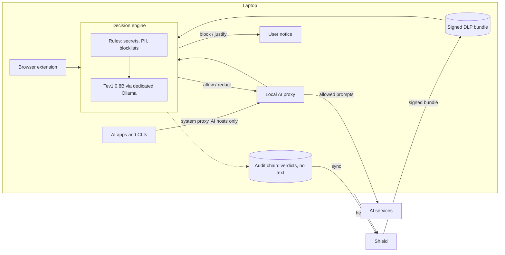

# Spec: Votal device agent (on-device DLP for AI)

> Status: **APPROVED 2026-09-29** (user: "approved"), with the decisions in §12.
> Planes:
> - **Device (new deployable, `packages/votal-device-agent`):** capture, decide,
>   record. No network in the decision.
> - **Data plane:** signed DLP bundle, device enrollment and heartbeat, event
>   ingest.
> - **Admin plane:** DLP policy settings, devices view.
>
> Builds on `docs/spec-swg-icap-adapter.md` (the ICAP adapter: AI host list,
> request extraction, rule tier), `docs/edge-fast-path.md` (browser extension,
> `/v1/edge/policy-bundle`), `packages/shield-mavlink` (signed bundles, offline
> audit chain) and the decision-model research recorded 2026-09-29.

## Why this exists

A central proxy with ICAP (the Zscaler model, and our `deploy/swg` today)
decrypts AI traffic somewhere else and asks a scanner. Two facts make that the
wrong place for DLP on AI prompts:

- **It cannot judge meaning inline.** The ICAP adapter's own design records a
  cloud text screen at 1.5 to 20 seconds, so only regex rules block inline and
  the model screen runs after the prompt has already gone.
- **The prompt leaves the laptop to be inspected,** and coverage depends on the
  tunnel being up: off VPN, on hotel Wi-Fi or offline, nothing is checked.

Decision models change the arithmetic. Ollama now serves typed "decision" models
on `/v1/systemone`: send a `state` and named questions, get back a choice with
probabilities and a confidence. The smallest, **Tev1 0.8B** (about 1 GB), runs
on an ordinary laptop. So the check can move onto the device: rules in
microseconds, then a local semantic decision, before the prompt is encrypted and
sent, with nothing leaving the device to be judged.

## 0. The idea in one paragraph

An agent on each managed laptop sees prompts headed for AI services (through the
browser extension and a local proxy that only opens AI hosts), checks them with
the tenant's rules, then asks a local Tev1 0.8B decision model through a
dedicated Ollama instance what kind of data they contain and whether the user
is moving company data out. It allows, redacts, blocks, or asks the user to
justify, records the verdict (not the text) in a tamper-evident log, and syncs
verdicts to Shield. Policy arrives as a bundle signed by Shield and pinned on
the device. Shield never needs to see the prompt.

## 1. What exists vs what is missing

| Area | Today | Gap |
|---|---|---|
| AI host list | `icap/config.py` `DEFAULT_AI_HOSTS` (18 web apps and APIs), mirrored in `deploy/swg/squid.conf` | none; reused |
| Request extraction | `icap/extract.py`: OpenAI, Anthropic, claude.ai Connect-RPC, Gemini web, Copilot; `icap/decompress.py`, `icap/protowire.py` | coupled to nothing device-specific; reused |
| Rule tier | `icap/policy.py`: tenant rules via `regex` with per-match timeouts, "empty policy allows everything" | the evaluator imports ICAP server types; needs a pure core both can share |
| Edge rules bundle | `GET /v1/edge/policy-bundle`: rules, blocklists, version, ETag. **Unsigned** | a device cannot trust an unsigned policy |
| Browser capture | `examples/browser-extension` (T0 rules, T1 heuristic, T2 server) | no local model; desktop apps and CLIs unseen |
| Signed bundles, offline audit | `shield_mavlink.bundle`, `shield_mavlink.audit` | not wired to DLP |
| Decision model | none on devices; Ollama 0.33.2 on the dev Mac returns 404 on `/v1/systemone` | needs a newer Ollama and the model |
| Devices | none | enrollment, identity, heartbeat, fleet view |

## 2. Problem & outcome

**Outcome, observable:**

1. On an enrolled Mac, pasting an AWS key into ChatGPT (browser) or Claude Code
   (CLI) is **redacted or blocked before it leaves the laptop**, with no network
   call on the decision path.
2. Pasting a customer list with no regex-detectable identifier is caught by the
   **Tev1 0.8B decision model** and blocked or sent to a "justify" step, per
   policy.
3. With the laptop **offline**, both still happen.
4. Shield's console shows the verdict, category, destination, app and device, and
   **no prompt text** unless the tenant opts in to redacted excerpts.
5. The fleet view shows every device's agent, bundle and model version, and
   flags devices that stopped reporting.
6. **Gates before `enforce` is offered** (measured in task 1, on the reference
   hardware below):

   | Measure | Gate |
   |---|---|
   | Per-category recall (credentials, personal data, customer data, source code, financial, health) on the DLP evaluation set | at least 0.80 |
   | False positives on the benign near-miss half | at most 3 % |
   | Decision latency p95, Apple M1 or later | 300 ms |
   | Decision latency p95, x86 laptop CPU without a GPU (reference: Intel Core i5, 16 GB) | 800 ms |

   Hardware classes that miss the latency gate run the model in monitor mode
   (after sending), rules still inline.

**Non-goals:**
- Not a secure web gateway. Only the configured AI hosts are opened; every other
  connection passes through untouched.
- No unmanaged or personal devices (the agent needs MDM to install its
  certificate and settings), no mobile, no Linux desktops in v1.
- No OS network extensions in v1 (macOS NetworkExtension, Windows WFP): v1
  covers apps that honour the system proxy or `HTTPS_PROXY`. Apps that ignore
  both are a later spec.
- No image, audio or file-content DLP in v1: attachments are recorded as
  "unreadable content", as ICAP does.
- No certification or legal claim about monitoring; the host list and the
  privacy defaults are what a works council reviews.

## 3. Architecture



### 3.1 Capture (v1)

| Path | Covers | How |
|---|---|---|
| Browser extension | web AI tools in Chrome and Edge | existing extension, calling the local agent over a loopback port instead of its heuristic T1 |
| Local AI proxy | apps and CLIs that honour the system proxy or `HTTPS_PROXY` (browsers, Claude Code, Codex CLI, Cursor, most SDKs) | mitmproxy engine with a Votal addon, on `127.0.0.1`; a PAC file (set by MDM) sends **only** the AI host list to it, everything else goes direct |

Certificates: the agent generates a **per-device CA** at install. Its key stays
on the device, readable only by root or SYSTEM (macOS keychain, Windows CNG),
and the install adds it to the machine trust store. A stolen CA opens one
laptop's AI traffic, not the whole fleet's (unlike a shared gateway CA).

Pinned apps: an app that refuses the device CA cannot be inspected. The policy
chooses per host: `block` or `allow_and_log`.

### 3.2 Decide

1. **Rules** (microseconds): the tenant's regex rules and keyword blocklists,
   evaluated by the same pure evaluator the ICAP adapter uses (extracted in task
   2). A rule hit knows the exact span, so it can **redact**.
2. **Tev1 0.8B** (only for prompts the rules did not block): one call to a
   **dedicated** Ollama instance (`127.0.0.1:11535`, started by the agent, so a
   user's own Ollama is untouched):

   ```json
   POST http://127.0.0.1:11535/v1/systemone
   {"model": "tev1:0.8b",
    "state": {"prompt": "<extracted text>", "destination": "chatgpt.com", "app": "Google Chrome"},
    "questions": {
      "category": {"type": "choice", "instructions": "What sensitive data does this text contain?",
                   "criteria": {"none": "Nothing sensitive", "credentials": "Passwords, keys, tokens",
                                "personal_data": "Personal data about a person",
                                "customer_data": "Customer or client records",
                                "source_code": "Proprietary source code",
                                "financial": "Non-public financial information",
                                "health": "Health or medical information"}},
      "exfil_intent": {"type": "noul",
                       "instructions": "Is the user trying to move company data outside the company?"}}}
   ```

   The questions, categories and thresholds come from the signed bundle, so a
   tenant tunes them without an agent release.
3. **Action**, from the bundle's thresholds:

   | Condition | Action |
   |---|---|
   | Rule hit with `redact` | send the redacted prompt |
   | Rule hit with `block` | block |
   | `category` probability at or above `block_p` for a blocking category | block |
   | at or above `justify_p`, or `exfil_intent` at or above its threshold | justify |
   | `confidence` below `min_confidence` | allow and record as `uncertain` |
   | otherwise | allow |

   The model says *what kind* of data, not *where*, so model hits cannot be
   redacted, only blocked or justified.

   **Updated by task 1 (measured, `dlp-bench/reports/SUMMARY.md`):** the signal
   is the probability mass away from `none` (1 - P(none)), labelled by the most
   likely category, not the chosen option's probability. The default questions
   ask whether the text *contains actual* data (`dlp-bench/questions_v2.json`);
   topic-style wording gave 46 % false positives. Each category also carries
   its own enforcement (`justify` or `monitor`): on Tev1 0.8B, source code,
   financial data and exfiltration intent are monitor-only until a model
   passes them.

**Justify** without holding the request open: the request is blocked with a
notice ("This looks like customer data. To send it anyway, give a reason"). The
user answers in the agent's menu-bar or tray app; the agent then allows the
**same prompt** (same hash, same destination) once within 60 seconds, and
records the reason.

**Blocking responses** reuse the ICAP adapter's per-provider block bodies, so a
blocked prompt shows as an error in the app rather than a broken connection.

### 3.3 Record

Every non-allow decision (and allows in `monitor` mode) is appended to a
hash-chained log (`shield_mavlink.audit.OfflineAuditChain`): time, verdict,
rule or category, probabilities, destination, app, device, prompt SHA-256 and
length. **No prompt text** unless the tenant sets `capture_excerpt`, which stores
the rule-redacted first 200 characters. Records sync to Shield when online.

## 4. Plane & latency contract

| Component | Runs | On a guard path? | Budget |
|---|---|---|---|
| Capture and decision | laptop | **the user's own outbound AI request** | rules under 1 ms; model p95 per §2.6; timeout `model_timeout_ms` (default 1500) |
| `GET /v1/edge/dlp-bundle` | data plane | No. Agents poll it (ETag, 304). | n/a |
| Enrollment, heartbeat | data plane | No. | n/a |
| Event ingest | data plane | No. Existing `/v1/shield/runtime/events`, background. | n/a |
| Devices view, DLP settings | admin plane (and data, like other tenant APIs) | **No.** Off hot path, no guarded-traffic impact. | n/a |

Shield's guard paths (`/guardrails/*`, `cap/mint`, `tools/call`) are untouched.
The optional server screen (§7) calls `/guardrails/input` in the background,
exactly as ICAP does, and is off by default.

## 5. Data model

### 5.1 Signed DLP bundle (served by `GET /v1/edge/dlp-bundle?fleet=`)

shield-mavlink's format (`{header, policy, signature}`, Ed25519 over the
canonical header and policy, bound to tenant, fleet, version and expiry), signed
with the runtime bundle key. The policy:

```json
{
  "mode": "monitor",
  "ai_hosts": ["chatgpt.com", "claude.ai", "..."],
  "pinned_host_action": {"default": "allow_and_log", "hosts": {"example-pinned.ai": "block"}},
  "rules": [{"id": "aws-key", "regex": "...", "action": "redact", "severity": "critical",
             "replacement": "[REDACTED]"}],
  "blocklists": ["project-atlas"],
  "rules_version": "<16 hex, from _build_bundle>",
  "model": {"name": "tev1:0.8b", "digest": "sha256:d45e875d...", "min_ollama": "0.35.0"},
  "questions": {"category": {...}, "exfil_intent": {...}},
  "thresholds": {"block_categories": ["credentials", "customer_data"], "block_p": 0.471,
                 "justify_p": 0.3, "exfil_intent": 0.25, "min_confidence": 0.0},
  "enforcement": {"credentials": "justify", "personal_data": "justify",
                  "customer_data": "justify", "health": "justify",
                  "source_code": "monitor", "financial": "monitor", "exfil_intent": "monitor"},
  "fail_mode": "allow",
  "model_timeout_ms": 1500,
  "privacy": {"capture_excerpt": false, "server_screen": false},
  "grace_s": 604800
}
```

`rules` and `blocklists` are built by the same function as today's
`/v1/edge/policy-bundle` (`api/routes_edge._build_bundle`), which stays
unchanged for the extension and ICAP.

Tenant settings for everything else live in `dlp_policy:{tenant_id}` (one JSON
value, validated strictly, no TTL), edited in the portal. The stored value also
holds `fleet_modes` (`{fleet_id: "monitor" | "enforce"}`), the per-fleet switch
§7 calls for; the bundle carries only the mode resolved for its own fleet.

**As built in task 2.** Defaults are task 1's measurements: the v2 questions, the
thresholds calibrated for `tev1:0.8b` (the numbers above), and `enforcement`,
where a `monitor` category is recorded but never blocks or asks for a reason. A
monitor category cannot be listed in `block_categories` (validation error).
`bundle_version` is the issue time, so it rises on every change and an agent can
refuse an older bundle replayed to it. Validity is `SHIELD_DLP_BUNDLE_VALID_S`
(default 86400). `kind: "dlp"` events are refused if `detail` holds `prompt`,
`text`, `body`, `content` or `message`, and `excerpt` is capped at 200
characters.

### 5.2 Devices

| Key | Shape | TTL |
|---|---|---|
| `devices:{tenant_id}` | HASH device_id -> `{hostname, os, os_version, agent_version, serial_hash, enrolled_at, fleet}` | none |
| `device_seen:{tenant_id}` | HASH device_id -> `{at, bundle_version, model_digest, mode, state, counters}` | none (staleness is computed from `at`) |
| `device_enroll:{tenant_id}:{token_sha256}` | `{fleet, uses_left, expires_at, created_by}` | until `expires_at` |

Each device gets its **own API key with scope `device`**: it can pull its bundle,
post heartbeats and events, and nothing else. It is stored in the macOS keychain
or Windows Credential Manager (DPAPI), readable only by the agent's service
account.

**As built in task 3.**
- Enrollment tokens look like `vde.<tenant_id>.<secret>`: at install the agent
  has nothing else to find its tenant by. Only the secret's SHA-256 is stored.
  Uses are counted with an atomic INCR on `device_enroll_used:{tenant_id}:{sha}`
  rather than a `uses_left` field, so two laptops cannot both take the last use.
  The token goes in the `X-Enrollment-Token` header; `/v1/devices/enroll` is the
  one path AuthMiddleware lets through without an API key, because the route
  checks the token itself.
- Device keys are `vdk_...`. The path limit (bundle, heartbeat, events) is a
  prefix test inside ShieldMiddleware: no store read and no extra middleware,
  so other requests, the guard path included, pay one string comparison. Only
  a `vdk_` key can be given scope `device`. The three endpoints also check the
  device record, so a revoke takes effect at once on every worker. A device key
  gets only its own fleet's bundle (403 otherwise), and its events are stamped
  with its own `device_id`, whatever the event says.
- A reinstall on the same machine (same `serial_hash` and fleet) keeps its
  `device_id` and replaces the old key, so reinstalls do not leave stale ghosts
  that look like tampered devices.
- Added beside the spec'd token POST: `GET` and
  `DELETE /v1/tenant/me/devices/enrollment-tokens[/{token_id}]`, so a leaked
  token can be stopped before it expires (it never lists the token itself).
- Enrollment returns 503 without a signing key, before a use is taken.
- Env: `SHIELD_DEVICE_AGENT` (on; off makes enrollment 404),
  `SHIELD_DEVICE_STALE_S` (3600).
- Portal: Enterprise Controls, then Device DLP. It has the fleet table, tokens
  and the policy editor.
- Modules: `core/dlp/devices.py`, `api/routes_devices.py`,
  `api/routes_device_dlp.py`.

### 5.3 On the device

The verified bundle, the pinned public key, the per-device CA, the audit chain,
and the justify allow-list (prompt hash, destination, expiry; memory only).

**As built in task 4** (`packages/votal-device-agent/`, standard library plus
the repo's `icap/rules.py` and `shield_mavlink`):
- **Verdict and action are separate.** `verdict` is what the policy says;
  `action` is what the agent does (allow, redact, block, justify). In
  `monitor` mode, and for monitor-only categories, the action is allow and the
  verdict is recorded. The model decision rule is the benchmark's, byte for
  byte, held equal by a test.
- **Justify** only for a prompt the agent asked about (pending for 5 minutes).
  The reason is at least 3 characters. The grant is single-use and lapses
  after 60 s.
- **Fallback when no bundle verifies:** the MDM's `fallback.json`, else built-in
  rules that **redact** known credential shapes (AWS, private keys, GitHub,
  Slack, Stripe live keys). No model in fallback. Trust state is kept in
  `trust_state.json`: the highest bundle version accepted, and the last server
  time seen (from the `Date` header).
- **Model on the send path only when its own measured p95 meets the gate**
  (`LatencyGate`; `model_inline` auto, always or never). Until it is measured,
  and on slower hardware, it judges after sending.
  - The agent loads the model at start (`keep_alive` 24 h, about 0.9 GB
    resident) because a cold load takes longer than `model_timeout_ms`, and
    would otherwise turn the first decisions into `model_unavailable`. Found
    against the real model, not the fake.
- **Excerpts** (`capture_excerpt` only) mask every rule and blocked term, not
  only redact rules.
- **Measured on an M3 against real `tev1:0.8b`, enforce mode:**

  | Prompt | Action | Category |
  |---|---|---|
  | A password | block | credentials |
  | Customer rows | block | customer data |
  | Patient record | justify | health |
  | AWS key | redact (by rule) | |
  | Benign, and a question about passwords | allow | |

  Decisions took 320 to 440 ms, with a warm-up p95 of 322 ms (just over the
  300 ms gate, so `auto` judges after sending on this machine).

## 6. API / interface

| Method | Path | Plane | Auth | Purpose |
|---|---|---|---|---|
| GET | `/v1/edge/dlp-bundle?fleet=` | data | device key | signed bundle, ETag/304; 503 when no signing key |
| POST | `/v1/devices/enroll` | data | enrollment token | `{hostname, os, os_version, agent_version, serial_hash}` -> `{device_id, api_key, fleet, pinned_public_key}` |
| POST | `/v1/devices/heartbeat` | data | device key | `{bundle_version, model_digest, mode, state, counters}` -> 204 |
| POST | `/v1/shield/runtime/events` | data | device key | existing; new `kind: "dlp"` |
| GET, PUT | `/v1/tenant/me/dlp-policy` | both | tenant key, writes behind the registry write gate | the settings in §5.1 |
| POST | `/v1/tenant/me/devices/enrollment-tokens` | both | admin | create a token for a fleet (uses, expiry) |
| GET | `/v1/tenant/me/devices` | both | tenant key | fleet view: last seen, versions, state, stale |
| DELETE | `/v1/tenant/me/devices/{device_id}` | both | admin | revoke: the device key stops working |

Device-local, loopback only: `127.0.0.1:{port}/v1/local/check` for the browser
extension (`{text, destination}` -> verdict), protected by a per-install
secret the extension reads through native messaging.

## 7. Security & backward compatibility

- **Nothing changes for existing tenants.** `/v1/edge/policy-bundle`, the
  extension and ICAP are unchanged. Agents exist only where MDM installs them.
- **Default `monitor`.** A tenant turns on `enforce` per fleet after the gates.
- **Fail mode.** Following the ICAP adapter's reasoning (failing closed on every
  AI request is a worse outage than the leak it prevents), `fail_mode` defaults
  to `allow`: if the model times out or is unavailable, rules still apply and the
  decision is recorded as `model_unavailable`. A tenant may set `block`.
- **Bundle trust.** No verified bundle: rules from the MDM-shipped fallback
  (secrets only) and `fail_mode`. Expired bundle: used for `grace_s` (default 7
  days) and reported as stale; after that, as if missing. Never an older bundle.
- **Model integrity.** The agent checks the Ollama model digest against the
  bundle at start and hourly; a mismatch means "model unavailable".
- **Who can loosen:** policy writes follow `SHIELD_REGISTRY_WRITE_SCOPE`; device
  keys cannot write policy.
- **Privacy by default:** prompts never leave the device for inspection;
  events carry hashes and verdicts; excerpts and the server screen are opt-in.
- **Tamper.** The agent runs as a root LaunchDaemon or a Windows service;
  standard users cannot stop it or change the proxy (MDM locks it). A local
  admin can; the heartbeat makes a silent device visible. This is detection,
  not prevention, and the docs say so.
- **Local proxy exposure:** binds `127.0.0.1` only; it forwards only AI hosts
  and refuses to act as a general proxy.

## 8. Packaging & deploy

- **New package** `packages/votal-device-agent/`: Python 3.12 daemon (mitmproxy
  addon, decision engine, sync), menu-bar and tray helper, built with PyInstaller
  into a notarized macOS `.pkg` and a signed Windows `.msi`. Bundles the
  required Ollama build; pulls the model by digest at install.
- **Device dependencies** (component-local `requirements.txt`, like
  shield-mavlink): `mitmproxy` (MIT), `regex`, `cryptography`, `httpx`.
- **Reused from the repo, not copied:** `icap/extract.py`, `icap/decompress.py`,
  `icap/protowire.py`, the pure rule evaluator (task 2), `shield_mavlink.bundle`,
  `shield_mavlink.audit`.
- **Server:** no new pip dependencies. New modules `core/dlp/` (policy model,
  bundle), `api/routes_devices.py`, `api/routes_dlp_policy.py`; if `admin_app.py`
  imports them they go into `Dockerfile.admin` in the same PR (guard test).
- **Env:** `SHIELD_DEVICE_AGENT` (on), and the existing
  `SHIELD_RUNTIME_BUNDLE_PRIVATE_KEY` (required: without it no DLP bundle is
  served).
- **MDM:** Jamf and Kandji profiles (proxy PAC, certificate trust, service),
  an Intune package; install writes the tenant, fleet, enrollment token and
  pinned key.

## 9. Failure modes & edge cases

| Case | Behaviour |
|---|---|
| Model timeout or error | rules applied; `fail_mode`; recorded `model_unavailable` |
| Ollama too old (no `/v1/systemone`) | agent refuses to use it and reports `model_unsupported` |
| Prompt longer than the model context | the last user turn is judged first; the rest in chunks up to `max_chunks` (default 4); rules see everything |
| Streaming or WebSocket prompts | extraction as ICAP does; `ws.chatgpt.com` and similar covered by the proxy |
| Pinned app | `pinned_host_action` per host |
| Non-English prompt | judged anyway; recorded with detected language; evaluation set is English in v1 |
| Laptop offline | everything local works; events queue in the audit chain |
| Clock skew | bundle expiry checked against the device clock and the last server time seen |
| Two quick edits of a blocked prompt | justify allow-list matches the exact hash only |
| User runs their own Ollama | untouched: the agent uses its own instance and port |

## 10. Test plan (Definition of Done)

- **DLP evaluation set** (task 1, before any agent code): at least 300 prompts
  across the six categories, half benign near misses (public code, synthetic
  data, a customer's own details used with consent); written by hand, never used
  to tune thresholds beyond a documented calibration split. Benchmark harness for
  `/v1/systemone`, results per hardware class, committed as a report.
- **Parity:** the agent's extraction and rules produce the same results as
  ICAP on ICAP's existing fixtures.
- **Decision mapping:** every row of §3.2 with a fake `/v1/systemone` replaying
  recorded responses.
- **Privacy:** no prompt text in audit records or events unless `capture_excerpt`.
- **Bundle attacks:** tampered, foreign-fleet, self-signed, expired past grace:
  as §7.
- **Proxy end to end:** mitmproxy test harness against a local fake AI service:
  redact, block, justify-then-allow, non-AI host untouched, pinned-host action.
- **Server APIs:** enrollment (token uses and expiry), device-scope key limits,
  heartbeat, revoke, fleet staleness, policy validation and write gate.
- **Packaging:** clean-venv suite green; `Dockerfile.admin` guard; macOS and
  Windows installers built in CI (signing in release only).

## 11. Task breakdown

One branch, `feat/device-dlp-agent`, one PR, one commit per task. Measure first.

| # | Task | Size |
|---|---|---|
| 1 | DLP evaluation set and `/v1/systemone` benchmark harness; Tev1 0.8B results on Apple Silicon and an x86 laptop CPU; gate report | M |
| 2 | Server: pure rule evaluator extracted from `icap/policy.py` (ICAP unchanged), `dlp_policy` model and API, signed `/v1/edge/dlp-bundle`, `kind: "dlp"` events | M |
| 3 | Devices: enrollment tokens, per-device keys (scope `device`), heartbeat, revoke, fleet API and portal view | M |
| 4 | Agent core: bundle verification, decision engine (rules, then Tev1 via dedicated Ollama), audit chain, sync, loopback check API; fake-Ollama tests | M |
| 5 | Capture v1: mitmproxy addon, per-device CA, PAC, block and justify flow, extension switched to the local check | M |
| 6 | Packaging and MDM: notarized `.pkg`, signed `.msi`, Jamf, Kandji and Intune profiles, install and verify commands, customer docs | M |

A later spec covers macOS NetworkExtension and Windows WFP capture for apps that
ignore the proxy.

## 12. Decisions taken (change any before approving)

1. **Tev1 0.8B** as the decision model (the user's choice), through a
   **dedicated** Ollama instance.
2. **v1 capture = system proxy (PAC) plus the browser extension;** OS network
   extensions later.
3. **mitmproxy** as the local interception engine rather than a new TLS proxy.
4. **Per-device CA,** key never leaves the device.
5. **`fail_mode: allow` by default,** as the ICAP adapter decided; tenants can
   choose `block`.
6. **No prompt text leaves the device by default.**
7. **Measure first:** the evaluation set and benchmark (task 1) decide whether
   `enforce` is offered on each hardware class.
